[[_TOC_]]

# Module 5 - Network 

##  Lab 10 - Network Components


### About this Lab

- The total time to complete these labs is 75 minutes. 
- After completing this lab, you will learn to:
  - Identify basic network commands like ```ip```
  - Identify cloud-init log files
  - Use cloud-init logs to verify configuration and current status
  - Identify how the network configuration is set between cloud-init and each tool: NetworkManager for RHEL, netplan for Ubuntu, and wicked for SLES
  - Identify the steps to disable cloud-init networking
  - Explain the impact of disabling cloud-init networking
  - Implement custom DNS and domain settings
  - Analyze the status of ports using ```ss```/```netstat```
  - Evaluate SELinux and firewalld configurations
  - Execute a packet capture using tcpdump


### Scenario 1 : Show basic network configuration
#### Overview Lab 10 Scenario 1

- Using the ```ip``` command, Identify the actual network configuration on the server
- Review the cloud-init logs

#### Deployment Lab 10 Scenario 1

Step 1: Deploy an RHEL VM
- Using the link below, please fill the required options identified with a `*`. Use this new VM for this lab.

  [](https://labboxprod.azurewebsites.net/api/Labbox?url=https://dev.azure.com/linuxninjas/azure%20linux%20academy%20-%20css/_git/azurelinuxacademy?path=/azure%20linux%20academy/azure_linux_foundation/module%205%20-%20network%20components/labs/lab10rhel.json)
  
#### Instructions Lab 10 Scenario 1

Step 1: Connecting to the VM lab10rhel
- Connect to the VM created in the previous step and switch to root account
  ``` bash
  sudo -i 
  ```

Step 2: Listing IP Addresses
- List IP addresses using the ip command and understand the output
  ``` bash
  ip addr show # Show all the network interfaces and their IP addresses 
  ```
  > **Note:**: Understanding the output

    | **Interface** | **Details** |
    |---------------|-------------|
    | **Loopback Interface (lo)** | `1: lo: <LOOPBACK,UP,LOWER_UP> mtu 65536 qdisc noqueue state UNKNOWN group default qlen 1000`<br>`link/loopback 00:00:00:00:00:00 brd 00:00:00:00:00:00`<br>`inet 127.0.0.1/8 scope host lo`<br>`valid_lft forever preferred_lft forever`<br>`inet6 ::1/128 scope host`<br>`valid_lft forever preferred_lft forever` |
    | **Explanation** | - `1: lo:` indicates the loopback interface, used for internal communication within the host.<br>- `<LOOPBACK,UP,LOWER_UP>` shows the interface flags, indicating that the loopback interface is up and running.<br>- `mtu 65536` specifies the Maximum Transmission Unit.<br>- `link/loopback 00:00:00:00:00:00 brd 00:00:00:00:00:00` shows the MAC address (all zeros for loopback) and the broadcast address.<br>- `inet 127.0.0.1/8 scope host lo` indicates the IPv4 address (127.0.0.1) with a subnet mask of /8.<br>- `inet6 ::1/128 scope host` indicates the IPv6 address (::1) for local communication. |
    |  |  |
    | **Ethernet Interface (eth0)** | `2: eth0: <BROADCAST,MULTICAST,UP,LOWER_UP> mtu 1500 qdisc mq state UP group default qlen 1000`<br>`link/ether 60:45:bd:03:4d:d1 brd ff:ff:ff:ff:ff:ff`<br>`inet 10.1.0.4/24 brd 10.1.0.255 scope global noprefixroute eth0`<br>`valid_lft forever preferred_lft forever`<br>`inet6 fe80::6245:bdff:fe03:4dd1/64 scope link`<br>`valid_lft forever preferred_lft forever` |
    | **Explanation** | - `2: eth0:` indicates the Ethernet interface.<br>- `<BROADCAST,MULTICAST,UP,LOWER_UP>` shows the interface flags, indicating that the Ethernet interface supports broadcast and multicast, and is up and running.<br>- `mtu 1500` specifies the Maximum Transmission Unit.<br>- `link/ether 60:45:bd:03:4d:d1 brd ff:ff:ff:ff:ff:ff` shows the MAC address (60:45:bd:03:4d:d1) and the broadcast address.<br>- `inet 10.1.0.4/24 brd 10.1.0.255 scope global noprefixroute eth0` indicates the IPv4 address (10.1.0.4) with a subnet mask of /24 and the broadcast address (10.1.0.255).<br>- `inet6 fe80::6245:bdff:fe03:4dd1/64 scope link` indicates the IPv6 link-local address (fe80::6245:bdff:fe03:4dd1). |

    
  <details>
    <summary>Screenshot: Listing IP Addresses</summary>

	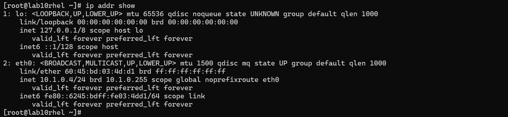
  </details> 

Step 3: Viewing Routing Table
- View the routing table using the ip command and understand the output.
   ``` bash
  ip route show # Displays the routing table, which includes the routes that the system uses to determine where to send network traffic
  ```
  > **Note:**: Understanding the output

  | **Route** | **Details** |
  |-----------|-------------|
  | **Default Route** | `default via 10.1.0.1 dev eth0 proto dhcp src 10.1.0.4 metric 100` |
  | **Explanation** | - `default` indicates the default route, which is used when no other specific route matches the destination.<br>- `via 10.1.0.1` specifies the gateway IP address (10.1.0.1) through which the traffic is routed.<br>- `dev eth0` indicates the network interface (eth0) used for this route.<br>- `proto dhcp` shows that the route was configured via DHCP.<br>- `src 10.1.0.4` specifies the source IP address (10.1.0.4) used for this route.<br>- `metric 100` specifies the route metric, which is used to prioritize routes. |
  |  |  |
  | **Specific Route** | `10.1.0.0/24 dev eth0 proto kernel scope link src 10.1.0.4 metric 100` |
  | **Explanation** | - `10.1.0.0/24` indicates the destination network (10.1.0.0) with a subnet mask of /24.<br>- `dev eth0` specifies the network interface (eth0) used for this route.<br>- `proto kernel` shows that the route was configured by the kernel.<br>- `scope link` indicates that the route is valid only for directly connected networks.<br>- `src 10.1.0.4` specifies the source IP address (10.1.0.4) used for this route.<br>- `metric 100` specifies the route metric. |
  |  |  |
  | **Specific Route** | `168.63.129.16 via 10.1.0.1 dev eth0 proto dhcp src 10.1.0.4 metric 100` |
  | **Explanation** | - `168.63.129.16` indicates the destination IP address.<br>- `via 10.1.0.1` specifies the gateway IP address (10.1.0.1) through which the traffic is routed.<br>- `dev eth0` indicates the network interface (eth0) used for this route.<br>- `proto dhcp` shows that the route was configured via DHCP.<br>- `src 10.1.0.4` specifies the source IP address (10.1.0.4) used for this route.<br>- `metric 100` specifies the route metric. |
  |  |  |
  | **Specific Route** | `169.254.169.254 via 10.1.0.1 dev eth0 proto dhcp src 10.1.0.4 metric 100` |
  | **Explanation** | - `169.254.169.254` indicates the destination IP address.<br>- `via 10.1.0.1` specifies the gateway IP address (10.1.0.1) through which the traffic is routed.<br>- `dev eth0` indicates the network interface (eth0) used for this route.<br>- `proto dhcp` shows that the route was configured via DHCP.<br>- `src 10.1.0.4` specifies the source IP address (10.1.0.4) used for this route.<br>- `metric 100` specifies the route metric. |

  > **Note:** In an Azure VM environment, additional specific routes are often configured to facilitate communication with Azure services and resources. Here are the explanations for the additional specific routes:
  >> - Route to 168.63.129.16: This route is used for communication with the Azure DHCP server and other Azure infrastructure services. The IP address 168.63.129.16 is a well-known Azure internal IP address used for various platform services. [Documentation](https://learn.microsoft.com/azure/virtual-network/what-is-ip-address-168-63-129-16)
  >> - Route to 169.254.169.254: This route is used for communication with the Azure Instance Metadata Service (IMDS). The IP address 169.254.169.254 is a link-local address used by Azure VMs to retrieve metadata about the VM, such as its configuration, network settings, and other information. [Documentation](https://learn.microsoft.com/azure/virtual-machines/instance-metadata-service?tabs=linux)

  <details>
    <summary>Screenshot: Viewing Routing Table</summary>

	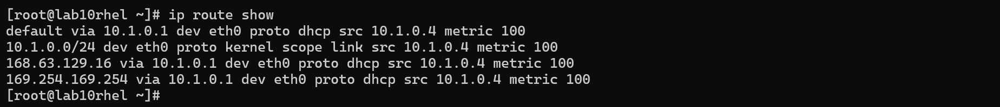
  </details> 

Step 4: Checking Interface Status
- Check the status of network interfaces using the ip command and understand the output.
  ``` bash
  ip link show # Displays the status and details of all network interfaces
  ```
  > **Note:**: Understanding the output
   
  | **Interface** | **Details** |
  |---------------|-------------|
  | **Loopback Interface (lo)** | `1: lo: <LOOPBACK,UP,LOWER_UP> mtu 65536 qdisc noqueue state UNKNOWN mode DEFAULT group default qlen 1000`<br>`link/loopback 00:00:00:00:00:00 brd 00:00:00:00:00:00` |
  | **Explanation** | - `1: lo:` indicates the loopback interface, used for internal communication within the host.<br>- `<LOOPBACK,UP,LOWER_UP>` shows the interface flags, indicating that the loopback interface is up and running.<br>- `mtu 65536` specifies the Maximum Transmission Unit.<br>- `qdisc noqueue` indicates the queuing discipline.<br>- `state UNKNOWN` shows the state of the interface.<br>- `mode DEFAULT` indicates the default mode.<br>- `group default` specifies the group.<br>- `qlen 1000` shows the queue length.<br>- `link/loopback 00:00:00:00:00:00 brd 00:00:00:00:00:00` shows the MAC address (all zeros for loopback) and the broadcast address. |
  |  |  |
  | **Ethernet Interface (eth0)** | `2: eth0: <BROADCAST,MULTICAST,UP,LOWER_UP> mtu 1500 qdisc mq state UP mode DEFAULT group default qlen 1000`<br>`link/ether 60:45:bd:03:4d:d1 brd ff:ff:ff:ff:ff:ff` |
  | **Explanation** | - `2: eth0:` indicates the Ethernet interface.<br>- `<BROADCAST,MULTICAST,UP,LOWER_UP>` shows the interface flags, indicating that the Ethernet interface supports broadcast and multicast, and is up and running.<br>- `mtu 1500` specifies the Maximum Transmission Unit.<br>- `qdisc mq` indicates the queuing discipline.<br>- `state UP` shows the state of the interface.<br>- `mode DEFAULT` indicates the default mode.<br>- `group default` specifies the group.<br>- `qlen 1000` shows the queue length.<br>- `link/ether 60:45:bd:03:4d:d1 brd ff:ff:ff:ff:ff:ff` shows the MAC address (60:45:bd:03:4d:d1) and the broadcast address. |

  <details>
    <summary>Screenshot: Checking Interface Status</summary>

	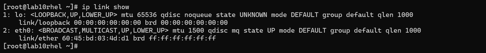
  </details> 

### Scenario 2 : Show cloud-init logs and network configuration
#### Overview Lab 10 Scenario 2

- Using the cloud-init logs and configuration file show how the network was configured
- Review the cloud-init logs

#### Instructions Lab 10 Scenario 2

Step 1: Connecting to the VM lab10rhel
- Connect to the VM used in the previous scenario and switch to root account
  ``` bash
  sudo -i 
  ```

Step 2: Check the ```cloud-init.log``` file
- Check the cloud-init file, this is a log with debugging output. Filter just messages related to network
  ``` bash
  grep -E -i 'network|eth|dhcp' /var/log/cloud-init.log # Searches for lines containing the words "network", "eth", or "dhcp", ignoring case distinctions.
  ```
  > **Note:** This shows the cloud-init making the network configuration on the system. Any potential error will be logged in this file
  
  <details>
    <summary>Screenshot: Checking cloud-init.log</summary>

	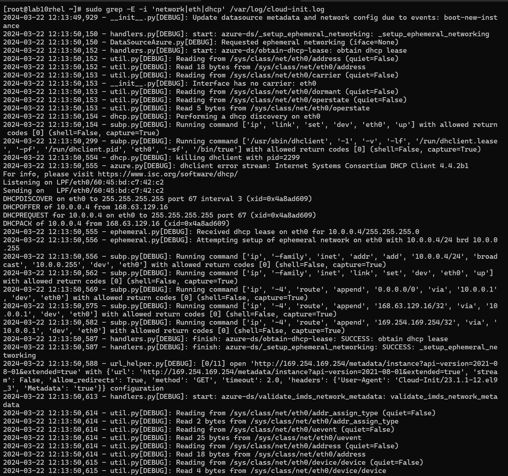
  </details> 

Step 3: Check the ```cloud-init-output.log``` file
- Check the logs for cloud-init, this includes the output from each stage of cloud-init. The network stage logs are here
  ``` bash
  cat /var/log/cloud-init-output.log # Displays the entire content of log file, which contains the output of the cloud-init process during system initialization.
  ```
  > **Note:** This is a smaller file than the previous
  
  <details>
    <summary>Screenshot: Checking cloud-init-output.log</summary>

	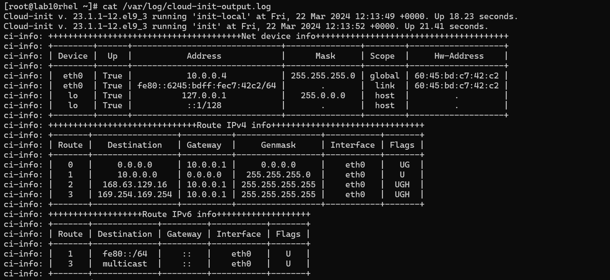
  </details> 


### Scenario 3 : Network managers across Linux distributions
#### Overview Lab 10 Scenario 3

- Check NetworkManager on RHEL
- Check netplan on Ubuntu
- Check wicked for SLES

#### Deployment Lab 10 Scenario 3

Step 1: Deploy an SLES VM
- Using the link below, please fill the required options identified with a `*`. Use this new VM for this lab.

  [](https://labboxprod.azurewebsites.net/api/Labbox?url=https://dev.azure.com/linuxninjas/azure%20linux%20academy%20-%20css/_git/azurelinuxacademy?path=/azure%20linux%20academy/azure_linux_foundation/module%205%20-%20network%20components/labs/lab10sles.json)

Step 2: Deploy an Ubuntu VM
- Using the link below, please fill the required options identified with a `*`. Use this new VM for this lab.

  [](https://labboxprod.azurewebsites.net/api/Labbox?url=https://dev.azure.com/linuxninjas/azure%20linux%20academy%20-%20css/_git/azurelinuxacademy?path=/azure%20linux%20academy/azure_linux_foundation/module%205%20-%20network%20components/labs/lab10ubuntu.json)

#### Instructions Lab 10 Scenario 3

Step 1: Connecting to the VM lab10rhel
- Connect to the VM created lab10rhel switch to root account
  ``` bash
  sudo -i 
  ```
Step 2: Verify NetworkManager Status
- Check the status of NetworkManager systemd unit
  ``` bash
  systemctl -l --no-pager status NetworkManager # Displays the complete, untruncated status of the NetworkManager service without using a pager, which is particularly useful when working with the serial console.
  ```
  > **Note:** Check the unit is ```enabled```, ```active``` and ```running```

  <details>
    <summary>Screenshot: Checking NetworkManager systemd unit</summary>

	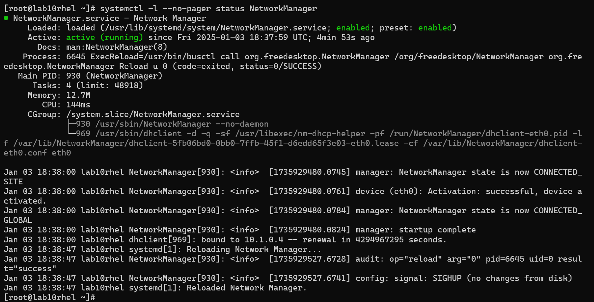
  </details> 

Step 3: List NetworkManager connections
- Run the following command to list all the active network connections managed by NetworkManager
  ```bash
  nmcli connection show --active #  Lists all currently active network connections managed by NetworkManager.
  ```
  <details>
    <summary>Screenshot: List all active NetworkManager connections</summary>

	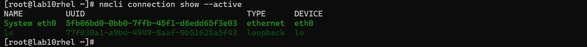
  </details> 

Step 4: Review the connection details for ```System eth0```
- Review the connection for ```System eth0```. A filter can be used to get the most important values during troubleshooting
  ```bash
  nmcli connection show 'System eth0' | grep -E 'GENERAL.STATE|IP4.ADDRESS|IP4.GATEWAY|IP4.ROUTE|IP4.DNS|IP4.DOMAIN|GENERAL.DEVICES|GENERAL.UUID'
  ```

  | Option             | Explanation of each value                                                                 |
  |--------------------|-------------------------------------------------------------------------|
  | GENERAL.UUID       | Shows the unique identifier for the connection profile.                 |
  | GENERAL.DEVICES    | Identifies the network interface device associated with the connection. |
  | GENERAL.STATE      | Indicates the current state of the connection (e.g., activated, deactivated). |
  | IP4.ADDRESS        | Shows the IPv4 address assigned to the interface.                       |
  | IP4.GATEWAY        | Displays the default gateway for the IPv4 network.                      |
  | IP4.ROUTE          | Lists the routing information for the IPv4 network.                     |
  | IP4.DNS            | Lists the DNS servers configured for the connection.                    |
  | IP4.DOMAIN         | Displays the domain name associated with the connection.                |

  <details>
     <summary>Screenshot: Getting information from a connection on NetworkManager</summary>

	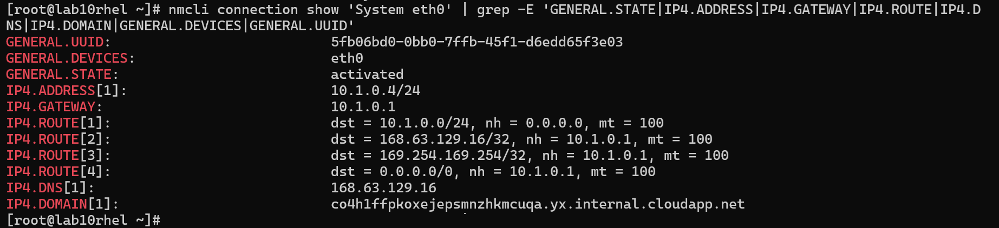
  </details> 

Step 5: Check the status of cloud-init
- Run the following command to check the status of cloud-init systemd unit
  ```bash
  systemctl -l --no-pager status cloud-init # Displays the complete, untruncated status of the cloud-init service without using a pager, which is particularly useful when working with the serial console.
  ```
  > **Note:** Check the unit is ```enabled```, ```active```. This time appears as ```exited``` and not ```running``` as cloud-init is designed to run only during the initial boot process of system


  <details>
     <summary>Screenshot: Getting information from a connection on cloud-init</summary>

	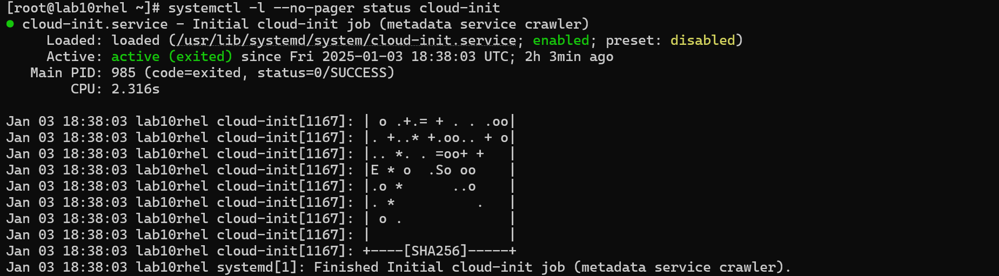
  </details> 

Step 6: Review the main cloud-init configuration file
- Filter the file ```/etc/cloud/cloud.cfg``` and find the lines related to network
  ``` bash
  grep -i 'network' /etc/cloud/cloud.cfg # Searches for lines containing the word "network" (case-insensitive)
  ```

  > **Network Configuration Renderers in cloud-init**

  | Renderer          | Description                                                                                  |
  |-------------------|----------------------------------------------------------------------------------------------|
  | sysconfig         | Uses the traditional network configuration files found in `/etc/sysconfig/network-scripts/`, commonly used in Red Hat-based distributions. |
  | eni               | Refers to the `/etc/network/interfaces` file, typically used in Debian-based distributions.   |
  | netplan           | Uses the Netplan configuration files found in `/etc/netplan/`, which is a newer method for configuring networking on Ubuntu and other distributions. |
  | network-manager   | Utilizes NetworkManager, a dynamic network control and configuration system that attempts to keep network devices and connections up and active when they are available. |
  | networkd          | Refers to systemd-networkd, a system service that manages network configurations for systemd-based systems. |
  > These renderers allow cloud-init to be flexible and compatible with various Linux distributions and their respective network configuration methods.

  <details>
     <summary>Screenshot: Getting the network related configuration from cloud-init</summary>

	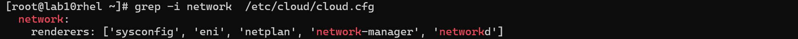
  </details> 

Step 7: Check the traditional network configuration file
- The file ```/etc/sysconfig/network-scripts/ifcfg-eth0``` is used to configure network settings for the ```eth0``` network interface on Red Hat-based Linux distributions. This specific file was automatically created by cloud-init. **Don't edit it manually!**
  ``` bash
  cat /etc/sysconfig/network-scripts/ifcfg-eth0
  ```
  <details>
     <summary>Screenshot: Getting information from the interface eth0</summary>

	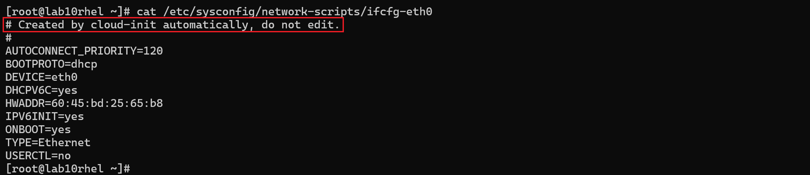
  </details> 

Step 8: Connecting to the VM lab10sles
- Connect to the VM lab10sles and switch to root account
  ``` bash
  sudo -i 
  ```

Step 9: Check the status of Wicked
- Check the status of Wicked systemd unit
  ``` bash
  systemctl -l --no-pager status wicked # Displays the complete, untruncated status of the Wicked service without using a pager, which is particularly useful when working with the serial console.
  ```
  > **Note:** Check the unit is ```enabled```, ```active```. This time appears as ```exited``` configures the network interfaces (lo, eth0), and then exits successfully with a status of 0

  <details>
     <summary>Screenshot: Check the Wicked systemd unit</summary>

	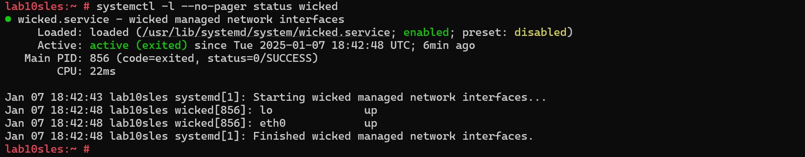
  </details> 

Step 10: Inspect Wicked Configuration
- List network interfaces managed by Wicked
  ``` bash
  wicked show all # Displays the status and configuration details of all network interfaces managed by Wicked.
  ```
  <details>
     <summary>Screenshot: Check the Wicked systemd unit</summary>

	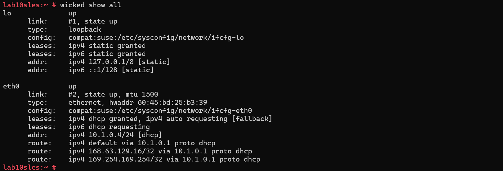
  </details> 

Step 11: Check the status of cloud-init
- Run the following command to check the status of cloud-init systemd unit
  ```bash
  systemctl -l --no-pager status cloud-init # Displays the complete, untruncated status of the cloud-init service without using a pager, which is particularly useful when working with the serial console.
  ```
  > **Note:** Check the unit is ```enabled```, ```active```. This time appears as ```exited``` and not ```running``` as cloud-init is designed to run only during the initial boot process of system

  <details>
     <summary>Screenshot: Getting information from a connection on NetworkManager</summary>

	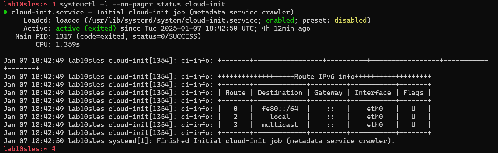
  </details> 

Step 12: Review the main cloud-init configuration file
- Filter the file ```/etc/cloud/cloud.cfg``` and find the lines related to network
  ``` bash
  grep -ri 'network' /etc/cloud/cloud.cfg # Searches for lines containing the word "network" (case-insensitive)
  ```
  
  > **Note:** This will not return any input here; however, the management of the network on SLES is hardcoded in cloud-init. Checking the cloud-init logs will show the presence of network configuration

  <details>
     <summary>Screenshot: Find network definiton on cloud-init</summary>

	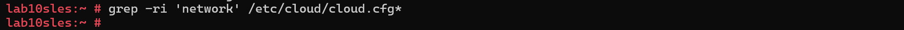
  </details> 

Step 13: Check the traditional network configuration file
- The file ```/etc/sysconfig/network/ifcfg-eth0``` is used to configure network settings for the ```eth0``` network interface on SLES. This specific file was automatically created by cloud-init. **Don't edit it manually!**
  ``` bash
  cat /etc/sysconfig/network/ifcfg-eth0
  ```
  <details>
     <summary>Screenshot: Getting information from the interface eth0</summary>

	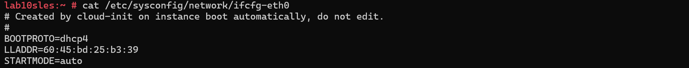
  </details> 

Step 14: Connecting to the VM lab10ubuntu
- Connect to the VM lab10ubuntu and switch to root account
  ``` bash
  sudo -i 
  ```

Step 15: Check the status of systemd-networkd
- Run the following command to check the status of systemd-networkd
  ``` bash
  systemctl -l --no-pager status systemd-networkd.service # Displays the complete, untruncated status of the systemd-networkd service without using a pager, which is particularly useful when working with the serial console.
  ```
  > **Note:** Check the unit is ```enabled```, ```active``` and ```running```

  <details>
     <summary>Screenshot: Getting information from the interface eth0</summary>

	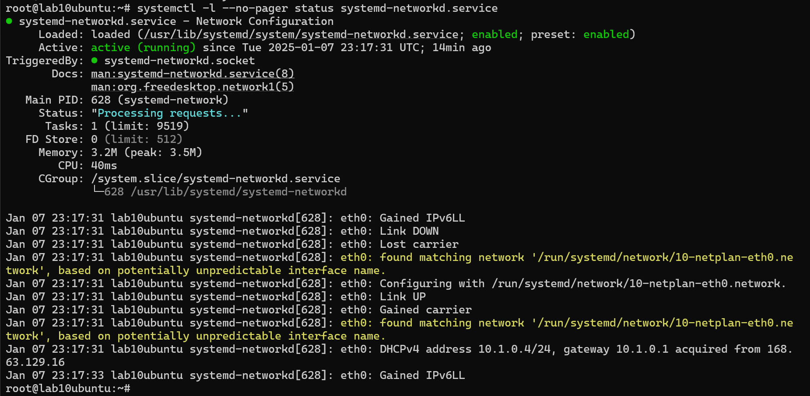
  </details> 

Step 16: Check the status of cloud-init
- Run the following command to check the status of cloud-init systemd unit
  ```bash
  systemctl -l --no-pager status cloud-init # Displays the complete, untruncated status of the cloud-init service without using a pager, which is particularly useful when working with the serial console.
  ```
  > **Note:** Check the unit is ```enabled```, ```active```. This time appears as ```exited``` and not ```running``` as cloud-init is designed to run only during the initial boot process of system

  <details>
     <summary>Screenshot: Getting information from a connection on cloud-init</summary>

	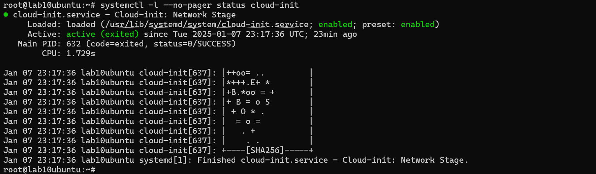
  </details> 

Step 17: Review the main cloud-init configuration file
- Filter the file ```/etc/cloud/cloud.cfg``` and find the lines related to network
  ``` bash
  grep -i 'network' /etc/cloud/cloud.cfg # Searches for lines containing the word "network" (case-insensitive)
  ```

  > **Network Configuration Renderers in cloud-init**

  | Renderer          | Description                                                                                  |
  |-------------------|----------------------------------------------------------------------------------------------|
  | netplan           | Uses the Netplan configuration files found in `/etc/netplan/`, which is a newer method for configuring networking on Ubuntu and other distributions. |
  | eni               | Refers to the `/etc/network/interfaces` file, typically used in Debian-based distributions.   |
  | network-manager   | Utilizes NetworkManager, a dynamic network control and configuration system that attempts to keep network devices and connections up and active when they are available. |
  | networkd          | Refers to systemd-networkd, a system service that manages network configurations for systemd-based systems. |
  
  > These renderers allow cloud-init to be flexible and compatible with various Linux distributions and their respective network configuration methods.

  <details>
     <summary>Screenshot: Getting the network related configuration from cloud-init</summary>

	
  </details> 

Step 18: Verify Netplan Configuration
- List Netplan configuration files
  ```bash
  ls /etc/netplan/ # List all the configuration files for netplan
  ```

  <details>
     <summary>Screenshot: List all the configuration files for netplan</summary>

	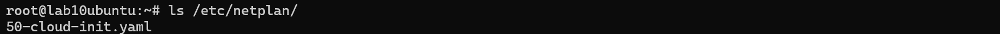
  </details> 

Step 19: Review the contents of each Netplan configuration file
- Usually the cloud-init has created a file here. Check the file
  ```bash
  sudo cat /etc/netplan/50-cloud-init.yaml
  ```
  <details>
     <summary>Screenshot: Check the content of the netplan file created by cloud-init</summary>

	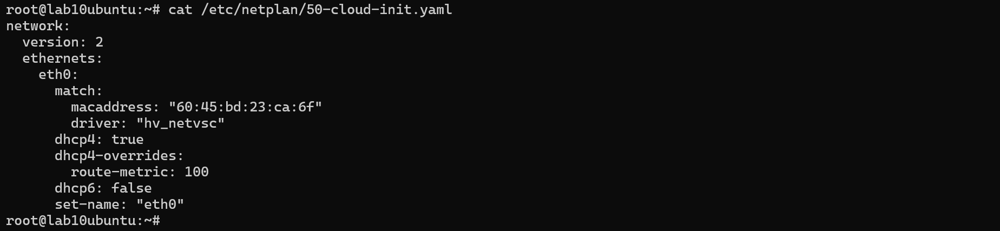
  </details> 

### Scenario 4 : Disabling networking from cloud-init
#### Overview Lab 10 Scenario 4

- Disable cloud-init networking module
- Replace the Network Interface assigned to lab10sles
- Fix broken network on the VM lab10sles

#### Instructions Lab 10 Scenario 4

Step 1: Connecting to the VM lab10ubuntu
- Connect to the VM created in the previous scenario and switch to root account
  ``` bash
  sudo -i 
  ```

Step 2: Disable networking management in cloud-init
- Create an additional configuration file for cloud-init which it will disable the networking management.
  ```bash
  echo "network: {config: disabled}" | sudo tee /etc/cloud/cloud.cfg.d/99-disable-network-config.cfg
  ```

  <details>
     <summary>Screenshot: Disable network management on cloud-init</summary>

	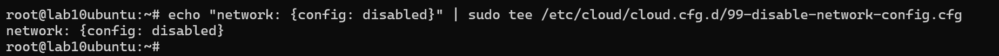
  </details> 

Step 3: Verify the change
- Check the contents of the configuration file to ensure the networking management is disabled:
  ```bash
  cat /etc/cloud/cloud.cfg.d/99-disable-network-config.cfg
  ```

  <details>
     <summary>Screenshot: Check the configuration include is correct</summary>

	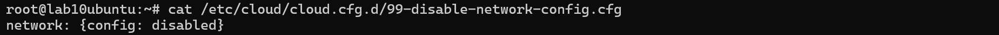
  </details> 

Step 4: Stop the VM
- Deallocate the VM, In the Azure portal, navigate to the VM's overview page. Click on "Stop" to deallocate the VM.

  <details>
     <summary>Screenshot: Deallocate the VM</summary>

	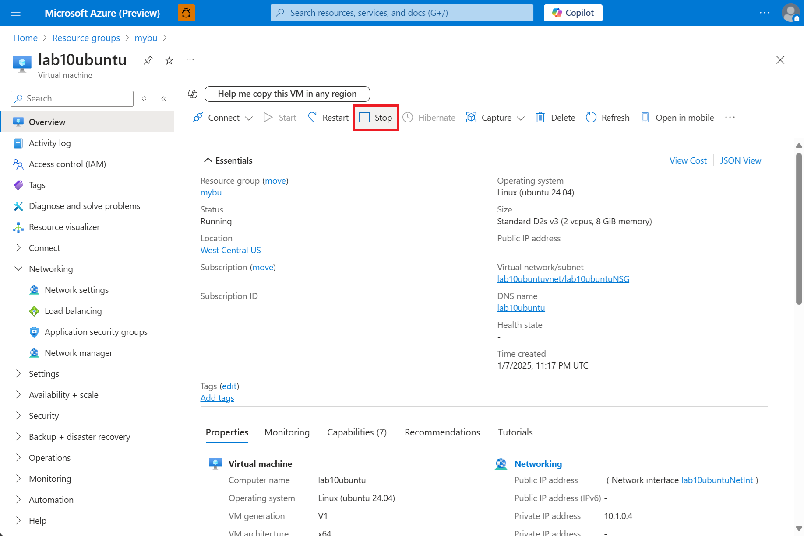
  </details> 

Step 5: Attach the new NIC
- Once the VM is deallocated, go to the "Networking" section of the VM. Click on "Attach network interface". From the dropdown select "lab10ubuntuSecondaryNetInt" and then click OK

  <details>
     <summary>Screenshot: Attach a new network interface</summary>

	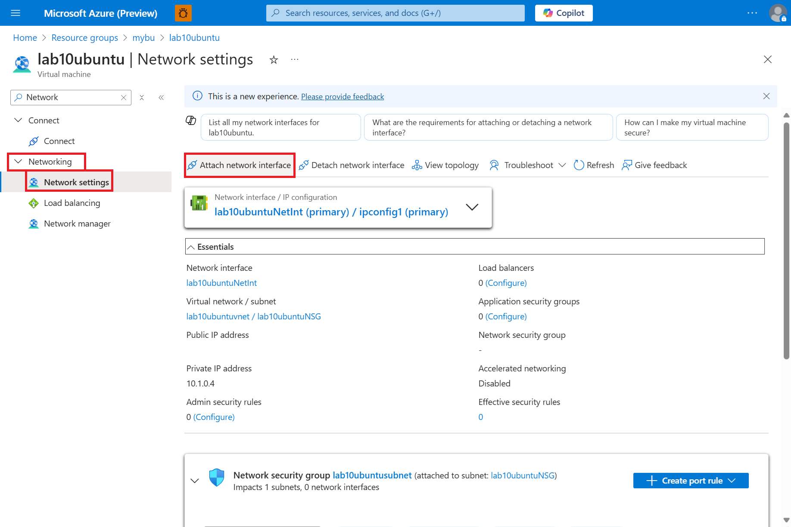
  </details> 

Step 6: Deattach the old NIC
- Click on "Detach network interface" to remove the NIC "lab10ubuntuNetInt" from the VM.

  <details>
     <summary>Screenshot: Deattach the old network interface</summary>

	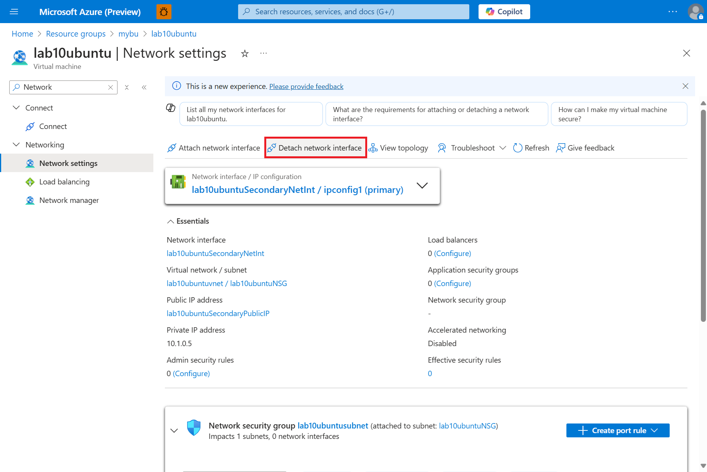
  </details> 

Step 7: Start the VM
- Return to the VM's overview page. Click on "Start" to power on the VM with the new NIC attached.

  <details>
     <summary>Screenshot: Start the VM back</summary>

	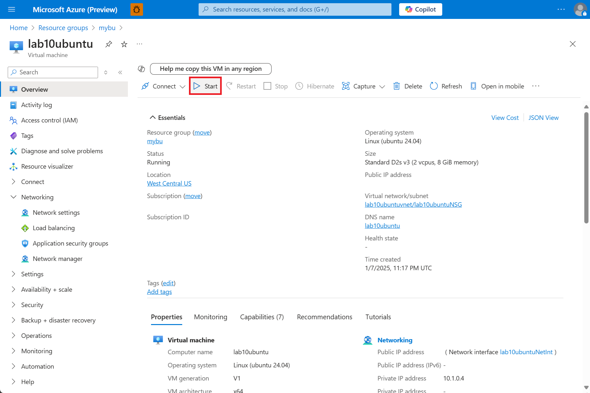
  </details> 

Step 8: Connect to the VM using the serial console
- Find the "Serial Console" option and connect using the user and password defined during the deployment of the system

  <details>
     <summary>Screenshot: Connect back to the VM using the Serial Console</summary>

	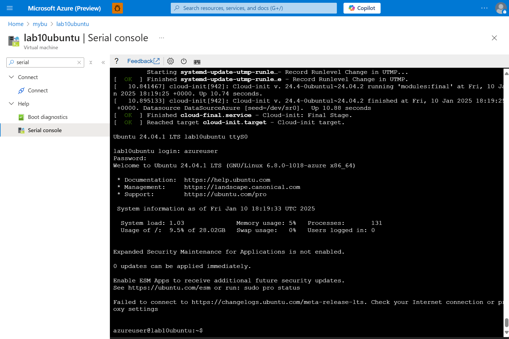
  </details> 

Step 9: Check current NIC hardware address
- Check the MAC for the NIC on the system and compare against the one configured on the netplan yaml file created previosuly by cloud-init
  ``` bash
  sudo -i
  ip a sh 
  cat /etc/netplan/50-cloud-init.yaml
  ```
  > **Note:** Compare both definitions. The MAC address assigned to the system is different from the one configured in Netplan. As a result, the network has not been configured correctly on the system, and no IP address or routes were configured

  <details>
     <summary>Screenshot: Return the the network management to cloud-init</summary>

	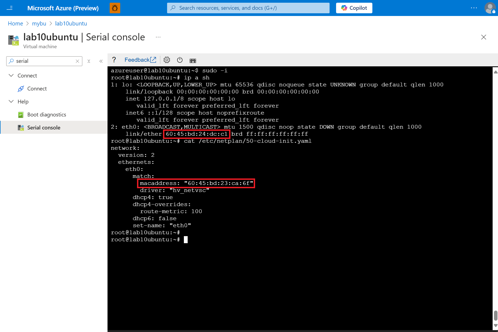
  </details> 

Step 10: Restore the cloud-init network manangement
- Removing the configuration file created on the Step 2. Optionally the MAC can be updated with the correct new value on /etc/netplan/50-cloud-init.yaml
  ``` bash
  cat /etc/cloud/cloud.cfg.d/99-disable-network-config.cfg # Check the content of the file
  rm /etc/cloud/cloud.cfg.d/99-disable-network-config.cfg # Remove the file 
  reboot # Reboot the system
  ```
Step 11: Connect to the VM
- Using ssh, connect to the VM, check the MAC for the NIC on the system and compare against the one configured on the netplan yaml file created previosuly by cloud-init
  ``` bash
  sudo -i
  ip a sh 
  cat /etc/netplan/50-cloud-init.yaml
  ```
  > **Note:** Compare both definitions. This time both MAC definitions will match and an IP address has been assigned to the interface

  <details>
     <summary>Screenshot: Get information about the NIC MAC</summary>

	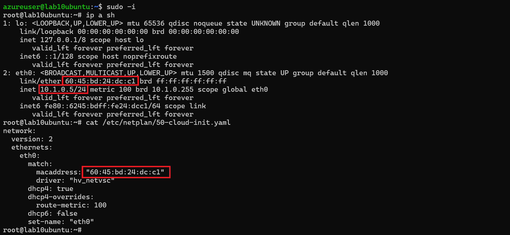
  </details> 

### Scenario 5 : Setting custom DNS and Domain
#### Overview Lab 10 Scenario 5

- Form the Azure Portal, change DNS and Domain

#### Instructions Lab 10 Scenario 5

Step 1: Connecting to the VM lab10sles
- Connect to the VM created in the previous scenario lab10sles and switch to root account
  ``` bash
  sudo -i 
  ```
Step 2: Changing to a custom DNS on the vnet from the Azure Portal
- Locate the VM lab10sles, find the "Network settings" and click on the Virtual Network created

  <details>
     <summary>Screenshot: Finding the VNET</summary>

	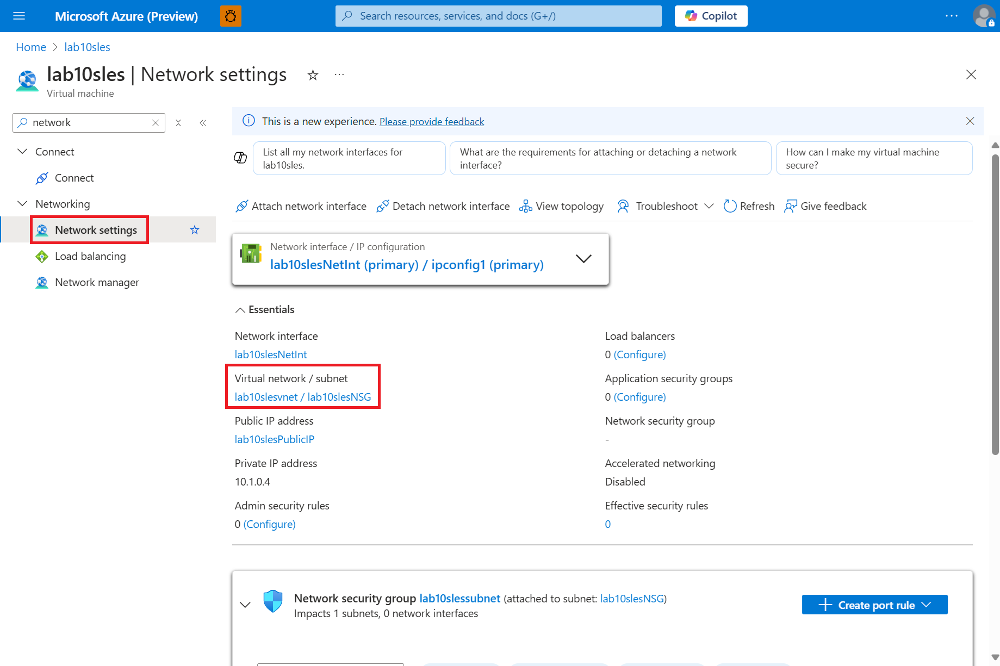
  </details> 

Step 3: Add DNS IP addresses to the VNET
- Once the VNET information is loaded, look for "DNS servers", click on "Custom" and add as DNS servers these dummy values ```1.2.3.4``` and ```2.3.4.5```. Click on Save

  > **Note:** These are not real DNS servers! Restart the VM from the Azure Portal

  <details>
     <summary>Screenshot: Changing the DNS on the VNET</summary>

	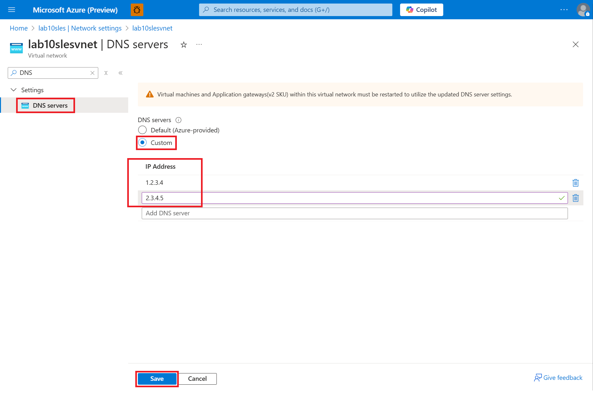
  </details> 

Step 4: Checking the DNS servers change
- Connect one more time to the VM. As root check the ```/etc/resolv.conf```. The new DNS servers should be already defined
  ``` bash
  sudo -i
  cat /etc/resolv.conf # Check the DNS configuration settings for the system.
  ```
  <details>
     <summary>Screenshot: Check the resolv.conf</summary>

	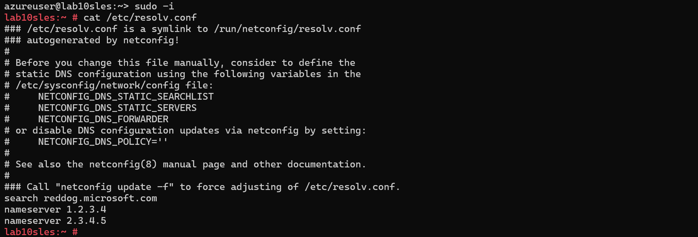
  </details> 

Step 5: Setting custom search domains
- As showed in the previous step, the default search domain is ```reddog.microsoft.com```. Change this to ```microsoft.com```
  ``` bash
  echo NETCONFIG_DNS_STATIC_SEARCHLIST="microsoft.com" >> /etc/sysconfig/network/config # Appends to the file setting a static DNS search list to include microsoft.com
  systemctl restart wicked.service # Restart wicked.service to apply any changes made to the network configuration on SLES
  cat /etc/resolv.conf # Check the DNS configuration settings for the system.
  ```
  <details>
     <summary>Screenshot: Change the search domain and check the resolv.conf</summary>

	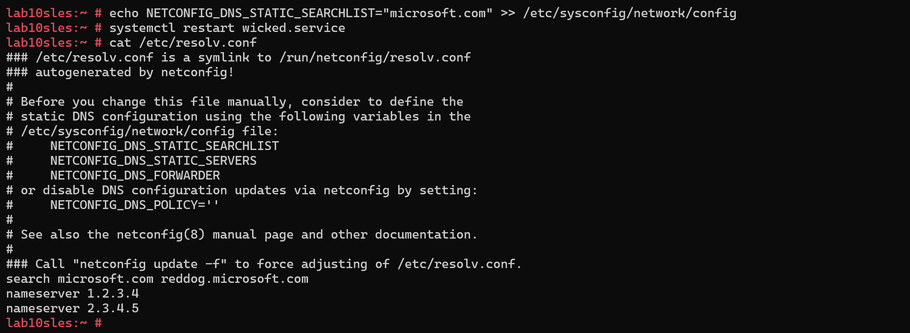
  </details> 

### Scenario 6 : Check connection for a webserver
#### Overview Lab 10 Scenario 6

- Check the status of a port using ```ss```/```netstat```
- Check SELinux configuration for a port
- Check firewalld configuration for a port
- Execute a packet capture of the web traffic using ```tcpdump```

#### Instructions Lab 10 Scenario 6

Step 1: Connecting to the VM lab10rhel
- Connect to the VM created in the previous scenario and switch to root account
  ``` bash
  sudo -i 
  ```

Step 2: Check the apache webserver is running
- Check the systemd unit for httpd and for the network sockets for port 80
  ``` bash
  systemctl -l --no-pager status httpd # Displays the detailed status of the httpd service without truncating the output or using a pager.
  ss -tuln | grep :80 # Lists all listening TCP and UDP sockets and filters the results to show only those using port 80.
  netstat -tuln | grep :80 #  Lists all listening TCP and UDP sockets and filters the results to show only those using port 80.
  ```

  <details>
     <summary>Screenshot: Check the webserver is running and binding the correct port</summary>

	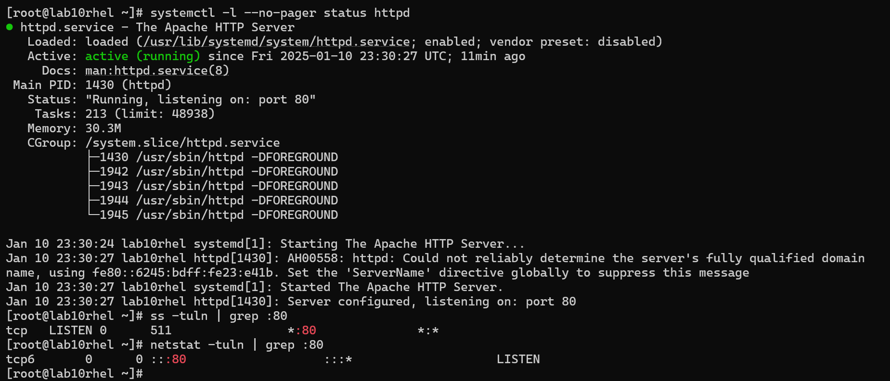
  </details> 

Step 3: Check SELinux
- SELinux can block the traffic to port 80. Make sure the status of SELinux and the rules
  ``` bash
  sestatus # Displays the current status of SELinux on the system.
  semanage port -l | grep http_port_t # Lists all SELinux port contexts and filters the results to show only those associated with the http_port_t type.
  ```

  <details>
     <summary>Screenshot: Check the webserver is running and binding the correct port</summary>

	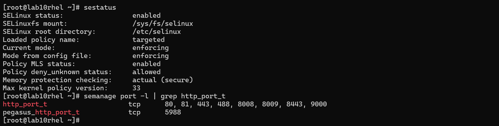
  </details> 

Step 4: Check firewalld
- On Enterprise Server based linux distribution firewalld is used to handle the internal firewall. Make sure its status and the rules on the system
  ```bash
  firewall-cmd --state # Displays the current state of the firewalld service.
  firewall-cmd --list-all # Displays all the current settings and configurations of the firewalld service.
  ```
 
  <details>
     <summary>Screenshot: Check the webserver is running and binding the correct port</summary>

	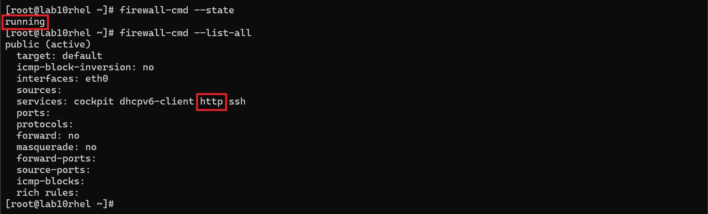
  </details> 

Step 5: Capturing Traffic for Port 80 Using tcpdump
- Capture traffic on port 80. Access the VM public IP from a webbrowser, once the test is done, hit ```Ctrl-C``` to stop the capture
  ``` bash
  tcpdump -i any port 80 and not host 168.63.129.16 # Captures network traffic on port 80 from all interfaces while excluding traffic from the IP address 168.63.129.16 which could be sending health probes to the VM.
  ```

  <details>
     <summary>Screenshot: Capture traffic for port 80, exclude from the Wire server</summary>

	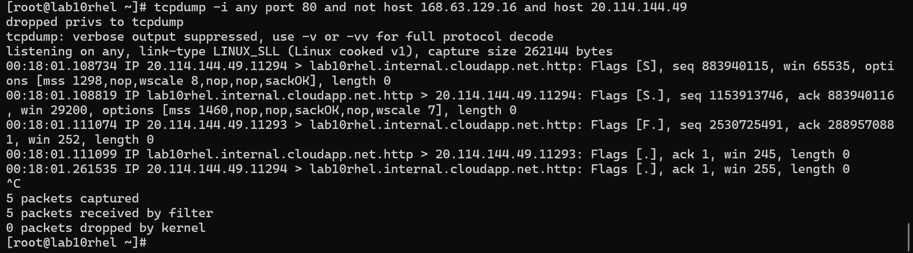
  </details> 

  > **Note:** The parameter ```-w``` can be used to save the capture in a pcap file
  ``` bash
   tcpdump -w mycapture.pcap -i any port 80 and not host 168.63.129.16
  ```

[Return to main menu](https://github.com/mitchcr/specialist/blob/main/README.md)
