[[_TOC_]]
# Module 1 - OS Fundamentals I Laboratories

## Lab 1 - WSL2 And Cloud Shell

### About Lab 1

- It will take approximately 90 minutes.
- This lab provides hands-on activities.
- After this lab you will be able to
  - Install WSL2 and Windows Terminal.
  - Install Azure CLI.
  - Create two Linux VMs and their required resources using Azure CLI.
  - Connect to a Linux system.
  - Change the ssh key used to authenticate to a Linux system using Azure CLI.

### Scenario 1: WSL and Windows Terminal

#### Deployment Lab 1 Scenario 1

Step 1: Deploy a Windows 11


- You can use your PC to complete this lab which it's the most recommended, however you could use a new Azure Windows 11 VM, if you are not allowed to install WSL in your PC.  If you need to create the Azure Windows 11 VM please do it using the link below:

  [](https://labboxprod.azurewebsites.net/api/LabBox?url=https://dev.azure.com/LinuxNinjas/Azure%20Linux%20Academy%20-%20CSS/_git/AzureLinuxAcademy?path=/Azure%20Linux%20Academy/Azure_Linux_Foundation/Module%201%20-%20OS%20Fundamentals%20I/Labs/Lab01windows11.json)  


#### Instructions Lab 1 Scenario 1 

Step 1: Check for Updates
- Make sure there are not pending updates for Windows.
  <details>
    <summary>Screenshot: Check for Updates</summary>

	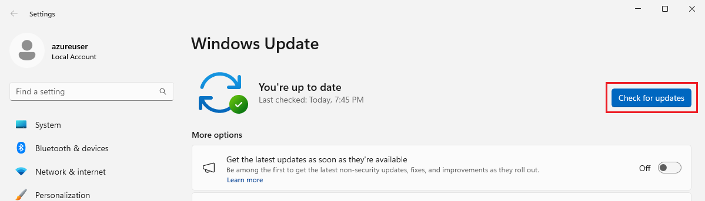
  </details>

Step 2: Install WSL
- Open an Command Prompt and install wsl.
  ``` bash
  wsl --install
  ```
  <details>
    <summary>Screenshot: Install WSL</summary>

	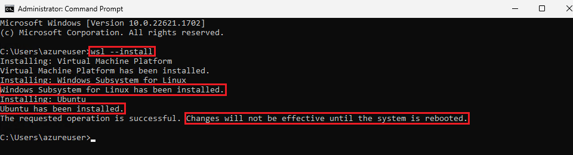
  </details>

Step 3: Finish Ubuntu installation
- Reboot the system. After logging back the Ubuntu installation will continue, it will ask for user and password.
  <details>
    <summary>Screenshot: Finish Ubuntu Installation</summary>

	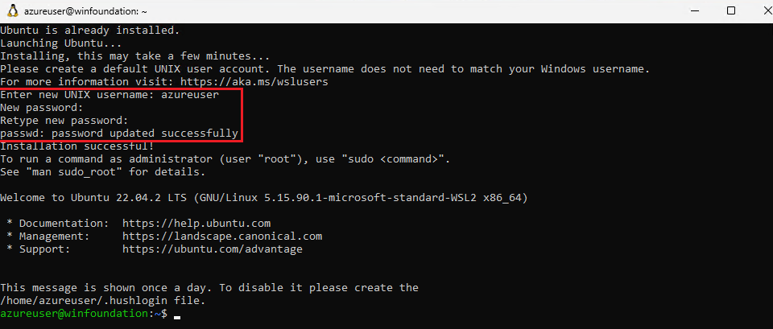
  </details>

Step 4: Get Windows Terminal
- Look for Windows Terminal on Microsoft Store, install or update to latest version. [Link to Microsoft Store](https://aka.ms/terminal). Click on "View in Store"
  <details>
    <summary>Screenshot: Windows Terminal</summary>

	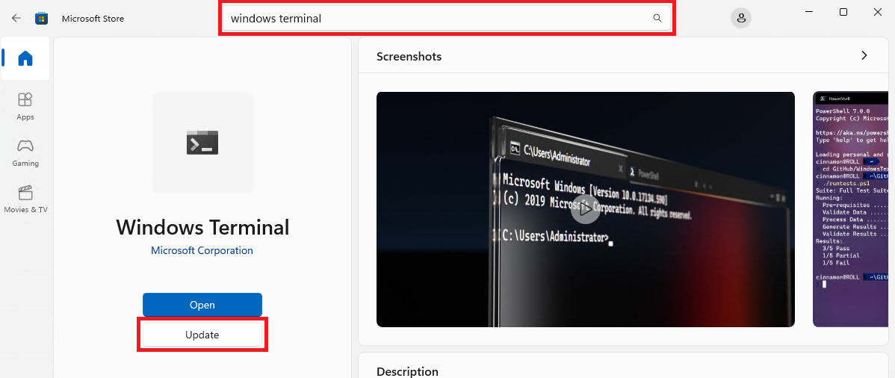
  </details>

Step 5: Open Ubuntu
- Open Windows Terminal and select new tab for Ubuntu.
  <details>
    <summary>Screenshot: Open Ubuntu</summary>

	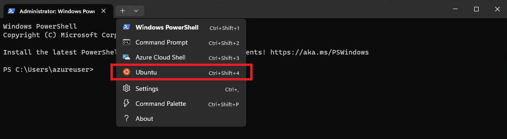
  </details>

Step 6: Install Linux Software Repository for Microsoft Products
- Configure the Linux Software Repository for Microsoft Products.  Using the default distribution that WSL installs, which is Ubuntu 22.04, you should do that executing the following commands in the Ubuntu tab in Windows terminal:

- Download the the repo config package 
  ``` bash
  curl -v -sSL -O https://packages.microsoft.com/config/ubuntu/22.04/packages-microsoft-prod.deb
  ```

- Verify the file downloaded and install the repo config package
  ``` bash
  ls
  sudo dpkg -i packages-microsoft-prod.deb
  ```
- Delete the repo config package after installing
  ``` bash
  rm packages-microsoft-prod.deb
  ```
- Update package index files
  ``` bash
  sudo apt-get update
  ```

  You can find more information about this in the following link, but it's not necesary to follow this documentation for the rest of this lab, just nice information to have in case you needed it in future. [Documentation](https://learn.microsoft.com/windows-server/administration/linux-package-repository-for-microsoft-software).

  <details>
    <summary>Screenshot: Install Linux Software Repository for Microsoft Products</summary>

	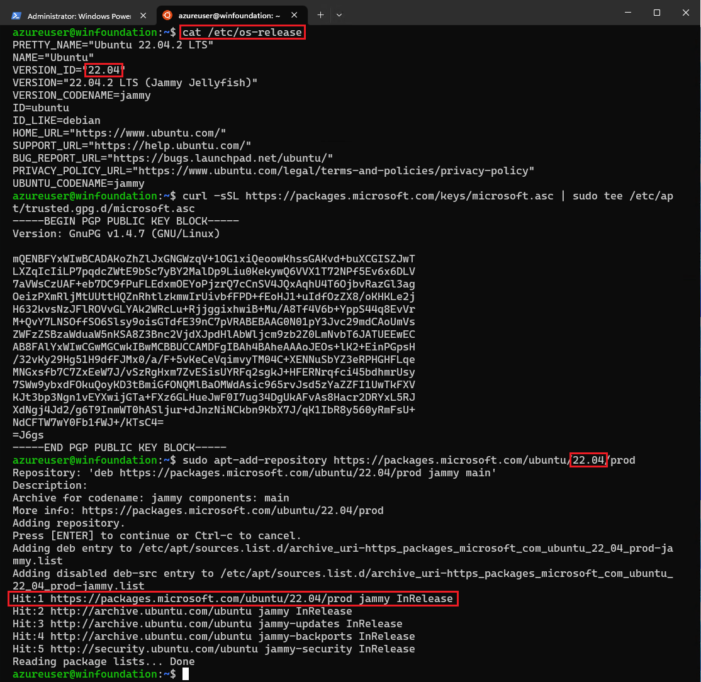
  </details>

Step 7: Install Azure CLI
- Install Azure CLI on Ubuntu. [Documentation](https://learn.microsoft.com/cli/azure/install-azure-cli-linux).
  ``` bash
  curl -sL https://aka.ms/InstallAzureCLIDeb | sudo bash
  ```
  <details>
    <summary>Screenshot: Install Azure CLI</summary>

	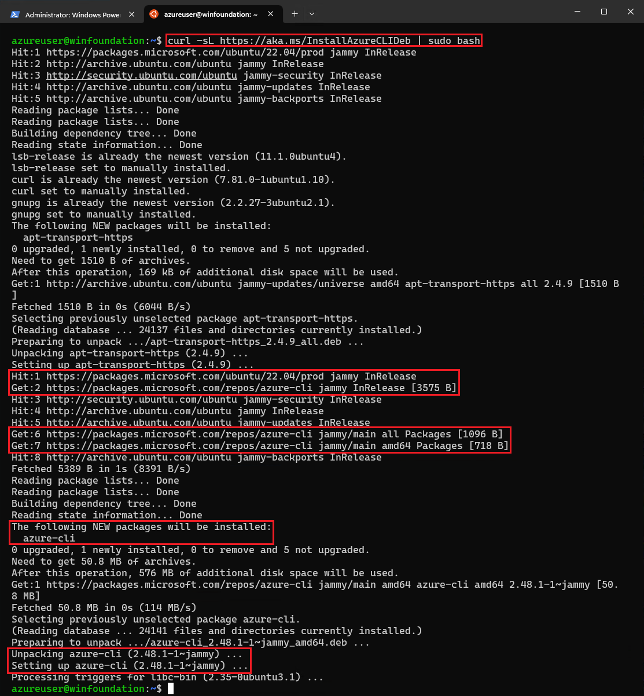
  </details>

Step 8: Log in to Azure
- By default it will try to open a web browser if it's available. With the option ```--use-device-code``` it will stop using any internal web browser and it will generate a code so it can be used at [https://microsoft.com/devicelogin](https://microsoft.com/devicelogin).
  > This method is not supported if you have a MCAPS Azure Subscription.

  ``` bash
  az login --use-device-code
  ```
  <details>
    <summary>Screenshot: Log in to Azure</summary>

	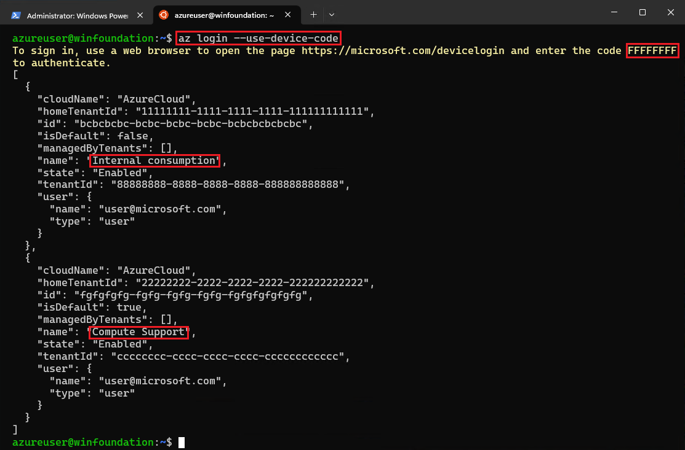
  </details>

Step 9: Using Azure CLI
- Get a list of available subscriptions and change the default.
  Change ```<SUBSCRIPTION__ID>``` for the proper value.

  ``` bash
  az account list --query "[].{Name:name, Id:id, IsDefault:isDefault}" -o table
  az account set --subscription <SUBSCRIPTION__ID>
  ```
  <details>
    <summary>Screenshot: List Azure Subscriptions and set the default</summary>

	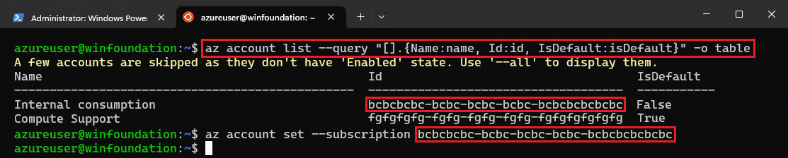
  </details>

Step 10: Azure CLI Help
- Getting Azure CLI Help
  ``` bash
  az group --help
  az group create --help
  ```

Step 11: Create foundationvm1 VM
- Create a Resource Group and a VM.
  Use ```foundationrg``` as resource group, ```foundationvm1``` as VM name and for the image use ```Ubuntu2204```.

  > Write down the IP assigned to foundationvm1, you will need it later.

  List the files on the directory ```.ssh``` and make a test connection to the new system and do a remote execution of the ```date``` command.
  > Make sure the NSGs are allowing ssh(22/TCP) traffic to your VM!

  ``` bash
  az group create --name foundationrg --location westus
  az vm create --resource-group foundationrg --name foundationvm1 --admin-user azureuser --image Ubuntu2204 --location westus --generate-ssh-keys --size Standard_D4ds_v5
  ls -l .ssh/id*
  ssh azureuser@20.20.20.20 date
  ```
  <details>
    <summary>Screenshot: Create resource group and foundationvm1 VM</summary>

	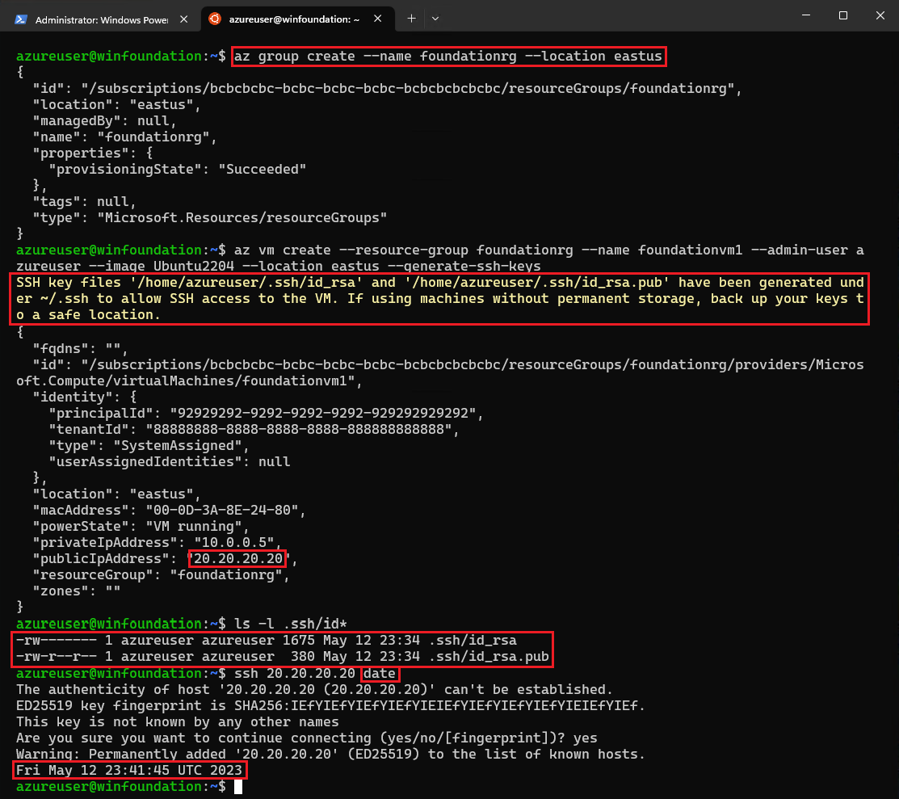
    > Notice the files inside the directory .ssh ```id_rsa``` is the ssh
    > private key and ```id_rsa.pub``` is the ssh public key.
  </details>

Step 12: Create foundationvm2 VM
- Install a virtual machine specifying a particular SKU code.

  Use ```foundationrg``` as resource group, ```foundationvm2``` as VM name and for the image use ```RedHat:RHEL:8-LVM:latest```. Notice the ```latest``` part!

  > Make sure the NSGs are allowing ssh(22/TCP) traffic to your VM!

  ``` bash
  az vm create --resource-group foundationrg --name foundationvm2 --admin-user azureuser --image RedHat:RHEL:8-LVM:latest --location westus --ssh-key-values ~/.ssh/id_rsa.pub --size Standard_D4ds_v5
  ssh azureuser@20.20.20.21 date
  ```
  <details>
    <summary>Screenshot: Create foundationvm2 VM</summary>

	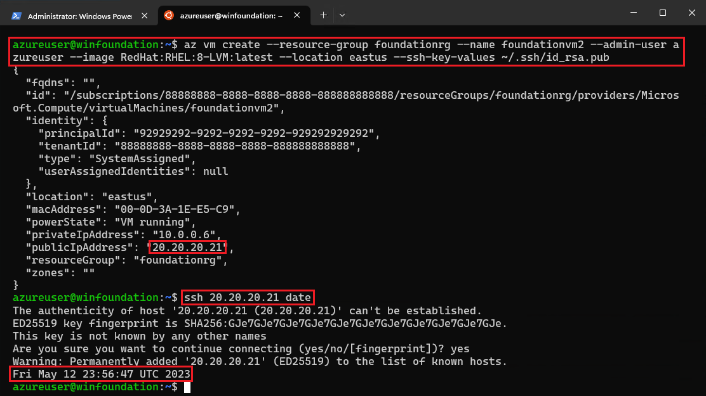
  </details>

### Scenario 2: Using Azure Cloud Shell

#### Instructions Lab 1 Scenario 2 

Step 1: Opening Azure Cloud Shell
- You can use the portal [https://shell.azure.com](https://shell.azure.com) or through a new tab on Windows Terminal, we are going to show this way.

  > Initial setup must be done through the web portal to define the required storage account. Select bash for the Azure Cloud Shell.

  > Using Azure Cloud Shell in Windows Terminal is not supported by Azure MCAPS Subscriptions, as device code authentication is not supported.

  <details>
    <summary>Screenshot: Using Azure Cloud Shell</summary>

	
  </details>

Step 2: Azure Cloud Shell
- With Azure Cloud Shell tab opened continue with the authentication.

  Once the bash shell is available, list the files of the directory ```.ssh```, if this is the first time with bash, the ssh keys will not be present  .
  
  ``` bash
  ls -l .ssh
  ```
  <details>
    <summary>Screenshot: Initial use of Azure Cloud Shell</summary>

	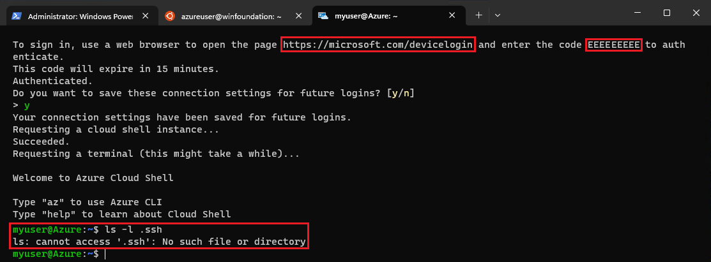
  </details>

Step 3: Connect to foundationvm1
- This operation will fail as the ssh keys used during the creation of the VM are not available in Azure Cloud Shell.

  Force the usage of ```azureuser``` in the ssh command to set the user, as in this example the Azure Cloud Shell is using ```myuser```.

  > Make sure the NSGs are allowing ssh(22/TCP) traffic to your VM!

  ``` bash
  ssh azureuser@20.20.20.20 
  ```
  <details>
    <summary>Screenshot: Connection to foundationvm1 from Azure Cloud Shell</summary>

	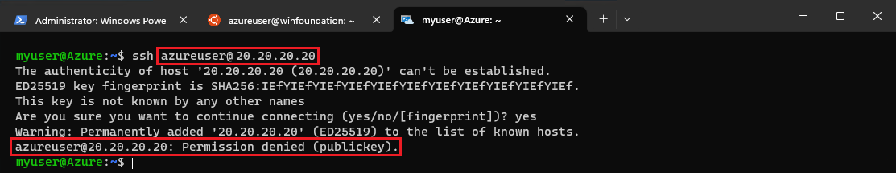
  </details>

Step 4: Generate new ssh keys
- Create a new set of keys for Azure Cloud Shell.

  List the resulting files as well.

  ``` bash
  ssh-keygen -N ''
  ls -l .ssh/
  ```
  <details>
    <summary>Screenshot: Create a new set of ssh keys</summary>

	
  </details>

Step 5: Update the VM's user information on foundationvm1
- Using Azure CLI update the VM and set the ssh public key for the user ```azureuser```.

  > This is going to use the vmaccess extension

  Test the ssh connection.

  ``` bash
  az vm user update --resource-group foundationrg --name foundationvm1 --username azureuser --ssh-key-value ~/.ssh/id_rsa.pub
  ssh azureuser@20.20.20.20
  ```
  <details>
    <summary>Screenshot: Update ssh key</summary>

	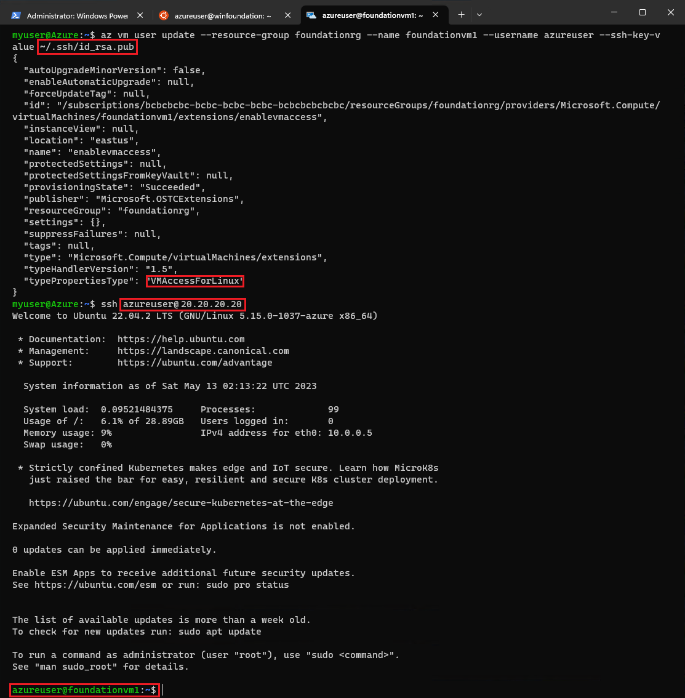
  </details>

##  Lab 2 - User and groups administration
### About Lab 2

- It will take approximately 30 minutes.
- This lab provides hands-on activities.
- After this lab you will be able to
  - Create and delete for users and groups.
  - Validate and change the ssh daemon configuration to allow password authentication.
  - Set passwords for users.
  - Check and change expiration date for users.
  - Add primary and secondary groups for users.

### Scenario 1: User and group administration

#### Instructions Lab 2 Scenario 1 

Step 1: Create a list of users through the file /etc/passwd
- Using the connection we have in previous step to foundationvm1 VM, switch to root and list the users created on the system.
  ``` bash
  sudo -i
  cat /etc/passwd
  ```
  <details>
    <summary>Screenshot: List users on the system using the file /etc/passwd</summary>

	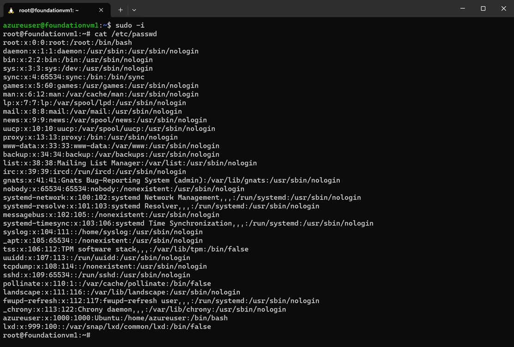
  </details>

Step 2: Create a list of users through getent
- Now list the users created on the system but using getent command: 
  ``` bash
  getent passwd
  ```
  <details>
    <summary>Screenshot: List users on the system using getent</summary>

	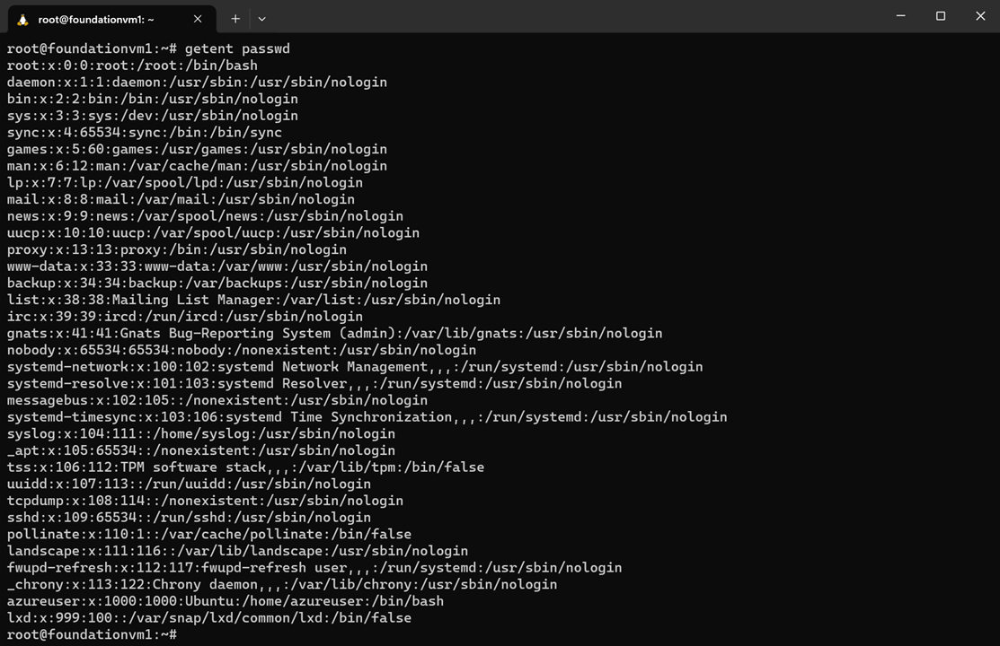
  </details>

Step 3: Create some users
- Using a for loop, create four users and get information of each user.  You can check for manual to get more detailed information on how it works.  For now a summary is offered after the "#" character, which we use to add comments in code.
  ``` bash
  for user in user01 user02 user03 user04    #loop created
  do
    useradd -m $user  #Create user
    getent passwd $user  #Retrieve and display user information
  done
  ```

  In previous command:
    - The ```for``` loop assign a variable called _user_ and iterates over a list of usernames ('user01','user02','user03',user04')
    - ```useradd -m $user``` creates a new user for each iteration. The home directory is not created in all the distributions while using the useradd. To make sure it's created you can use the flag -m  when executing the useradd command.
    - ```getent passwd $user```  retrieve and display details about the user in current iteraction

    <details>
    <summary>Screenshot: Create four users with a loop</summary>

	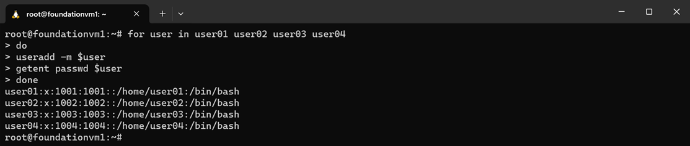
    </details>

Step 4: Set the password for created users
- Using a similar loop it is possible to set a password for all the users. The password in the following shell code is just an example. Please set your own one
  ``` bash
  for user in user01 user02 user03 user04  #loop created
  do
  echo "$user:MyP@ssW0rd" | chpasswd  #echo command will repeat what we have inside the quotes.   Adding the pipe will be executing the next command which is _chpasswd_ to the output.  So with each iteraction, we're changing the password for that iteraction with the contents of the quotes in echo command.
  done
  ```

  > For password batch changes on Ubuntu and Debian it's through the command chpasswd, for normal operations the _password_ command is the recommended, it will ask for the password when executed.

  ``` bash
  passwd user01
  ```
  <details>
    <summary>Screenshot: Change the password for all the users, batch mode and manually for Ubuntu and Debian</summary>

	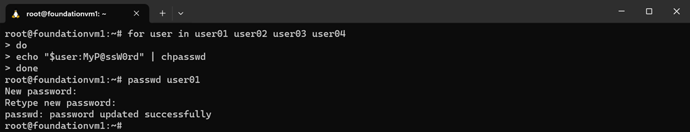
  </details>
  <details>
    <summary>Screenshot: Change the password for all the users, batch mode in other distributions</summary>

	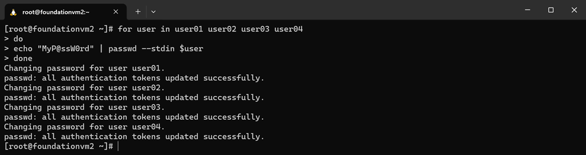
  </details>

  > For other distributions the same passwd could be use with the flag --stdin

Step 5: Make sure the password authentication is enabled for sshd
- If the system has been setup with an user with a ssh key, password authentication will be disabled.
  ``` bash
  sed -i 's/PasswordAuthentication no/PasswordAuthentication yes/' /etc/ssh/sshd_config  
  systemctl restart sshd
  ```
 
   In previous commands:
    - ```sed``` command will filter the ```/etc/ssh/sshd_config``` configuration file, changing the line ```PasswordAuthentication no``` for ```PasswordAuthentication yes```
    - ```systemctl restart sshd``` will restart the ssd service to read the changes in the configuration file.

  <details>
    <summary>Screenshot: Change the PasswordAuthentication parameter on /etc/ssh/sshd_config</summary>

	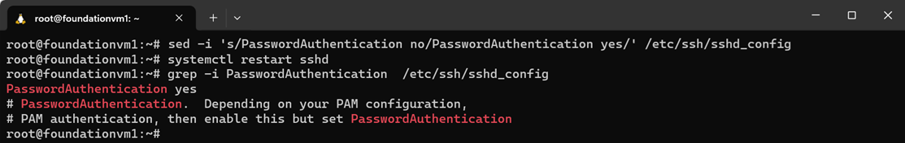
  </details>

Step 6: Delete some users
- Delete the users user01 and user02. With the second user use the flag ```-r``` and check the difference.
  ``` bash
  userdel user01
  userdel -r user02
  ls -l /home
  ```

  > The home directory is kept if the flag ```-r``` is not used. In the ```ls -l``` output the directory ```/home/user01``` remains but it doesn't belong to any user in the system. The ownership remains on the UID and GID for the deleted user01

  <details>
    <summary>Screenshot: Delete user01 and user02</summary>

	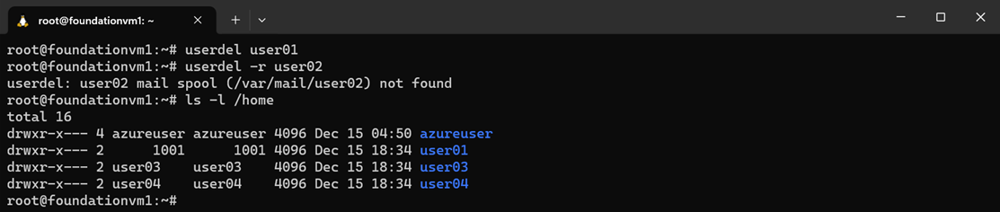
  </details>

- Check the latest lines in groups file on the system.
  ``` bash
  tail -10 /etc/group
  ```
  <details>
    <summary>Screenshot: Check current groups</summary>

	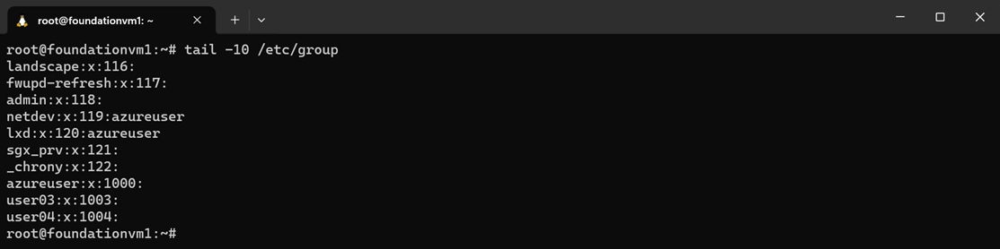
  </details>

  > For each user a new group has been created using the same name. As the users are removed, those groups are removed as well

Step 7: Create additional groups and assign users to those groups
- Create two new groups on the system and assign the remain two users to those groups. Check before and after the groups assigned to each user
  ``` bash
  groupadd group01
  groupadd group02
  groups user03
  groups user04
  usermod -aG group01 user03
  usermod -aG group02 user04
  groups user03
  groups user04
  ```
  <details>
    <summary>Screenshot: Create groups and assign those groups to users</summary>

	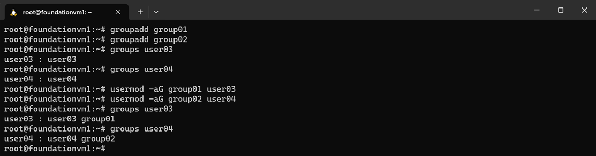
  </details>

## Lab 3 - File operations, manipulating and finding files

### About Lab 3

- It will take approximately 30 minutes.
- This lab provides hands-on activities.
- After this lab you will be able to:

  - How to navigate through a filesystem, create and destroy directories, create and find files based on name or permissions
  - How to copy, rename and move files between directories and execute actions on found files
  - How to manipulate text files by redirecting, concatenating and appending outputs into files

### Scenario 1: Managing files

#### Instructions Lab 3 Scenario 1 

Step 1: Create an empty file inside a new directory
- Using the VM foundationvm1 from the previous lab1. Create in the home directory a directory called ```files-lab``` and create an empty file called ```test.txt``` inside the previous created directory.
  ``` bash
  pwd              #Print current directory
  cd ~             #Change directory to user's home
  mkdir files-lab  #Creates a directory
  cd files-lab     #Change directory to new created
  touch test.txt   #Creates an empty file 
  ls -la           #Lists with details all the files inside current directory
  ```
  <details>
    <summary>Screenshot: Create an empty file inside a new directory</summary>

	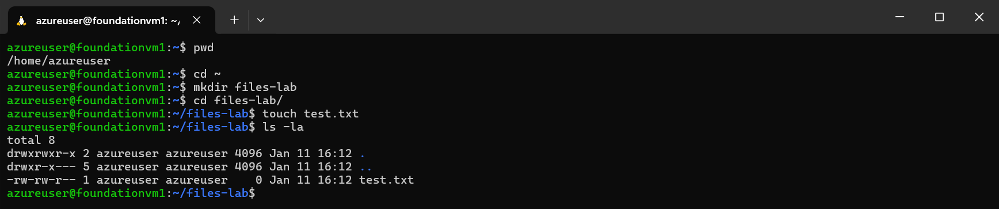
  </details>

  > The directory ~ refers to the actual home directory

Step 2: Create files using redirection
- Inside the same directory create files using type of redirection, ```>``` will overwrite the file, ```>>``` will append the output to the file
  ``` bash
  cd ~/files-lab                            #Change directory
  ls -la > test2.txt                        #Redirects the output to the first command to the file specified
  echo "This is a test" > test3.txt         #Redirects the output to the first command to the file specified
  cat test2.txt test3.txt > merged.txt      #Redirects the output to the first command to the file specified
  ls -la >> merged.txt                      #Append the output of the first command to the file specified
  cat merged.txt                            #Display file contents
  ```
  <details>
    <summary>Screenshot: Create an empty file inside a new directory</summary>

	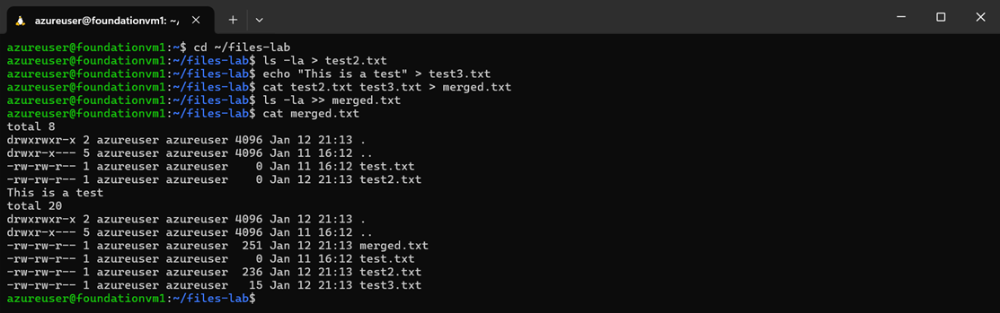
  </details>

Step 3: Copy and move the test files
- Using the commands ```cp``` and ```mv``` to copy, move and rename files. To copy to /etc it's required to use elevated permissions with sudo
  ``` bash
  cp -p test.txt test-copy.txt 
  mv test-copy.txt ~/
  cd ~
  ls -la
  mv test-copy.txt TEST.txt
  cp TEST.txt test-backup.txt
  sudo mv test-backup.txt /etc
  ls -l /etc/test-backup.txt
  ```
  <details>
    <summary>Screenshot: Copy, moving and renaming</summary>

	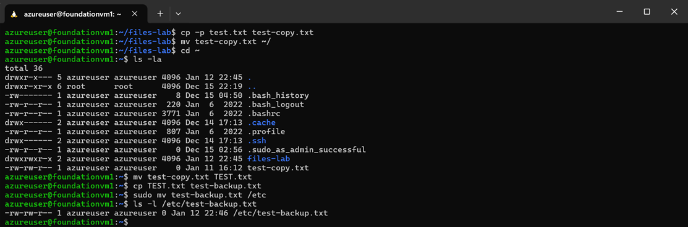
  </details>

  > Notice sudo may or may not ask for your password depending in the sudoers configuration

Step 4: Finding files in the system
- Using the command ```find```
  ``` bash
  find / -name test-backup.txt 2> /dev/null
  sudo find / -name test-backup.txt
  sudo cp /etc/test-backup.txt /etc/test-BACKUP.txt
  sudo find / -iname test-backup.txt
  ```
  <details>
    <summary>Screenshot: Finding files</summary>

	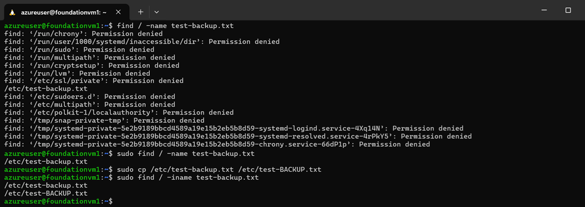
  </details>

  > Notice sudo may be required to find files if the root user is not been used to avoid permission denied errors

  > The option -iname can be used to ignore the case sensitive search

Step 5: Deleting directory used on this lab
- Using the commands ```rmdir``` and ```rm``` remove the directory and its content
  ``` bash
  rmdir  files-lab
  rm -r files-lab
  ls -l files-lab
  ```
  <details>
    <summary>Screenshot: Deleting a directory</summary>

	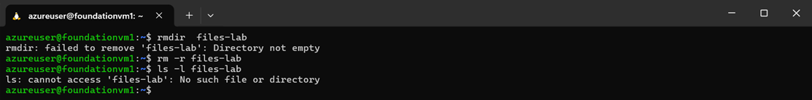
  </details>

  > Notice rmdir will only work only if the directory has no content. If it's required to delete a directory that contains files, it's required to use rm -r which it will delete everything

## Lab 4 - Linux process management

### About Lab 4

- It will take approximately 20 minutes.
- This lab provides hands-on activities.
- After this lab you will be able to:

  - Identify high utilization on system resources like CPU and memory
  - Use the commands top, ps, lsof and kill
  - Show all the running processes on the system
  - Identify and terminate processes

### Scenario 1: Checking OS performance

#### Instructions Lab 4 Scenario 1

Step 1: Install the stress utility
- Using the VM foundationvm1 from the previous lab1. Switch to root and install the utility ```stress``` run the command. Using this command, start a stress test using 4 CPUs
  ``` bash
  sudo -i 
  apt -y install stress
  stress -c 4
  ```
  <details>
    <summary>Screenshot: Install and run the stress utility</summary>

	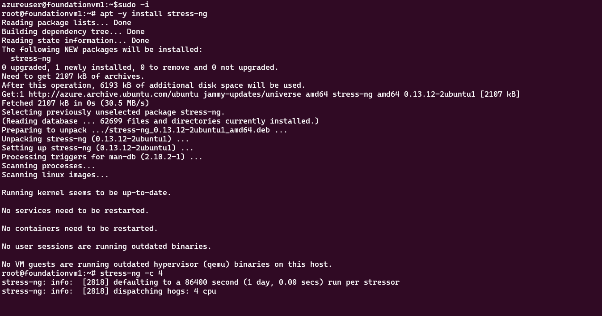
  </details>

  > The execution of the stress utility is running in the foreground. Leave the process running in this terminal!

Step 2: CPU information
- Open another terminal to the same foundationvm1. Get the CPU information, using the proc file and the ```lscpu``` utility
  ``` bash
  cat /proc/meminfo
  lscpu
  ```
  <details>
    <summary>Screenshot: Get the CPU information</summary>

	
  </details>

  > Notice even though the model name of the CPU may indicate certain amount of cores this is only for the host, the VM will have just a fraction of the real numbers on the host. For example foundationvm1 appears as an Intel(R) Xeon(R) Platinum 8370C CPU @ 2.80GHz which on Intel's product details says 26 cores and 52 threads, the VM reports 2 cores and 2 threads for a total of 4 CPUs. The relationship ratios between physical core and vCPU may vary depending on VM SKU family https://learn.microsoft.com/en-us/azure/virtual-machines/acu

Step 3: Memory information
- On the previous terminal, using a proc file and the command ```free```get the memory information
  ``` bash
  cat /proc/meminfo
  free -m
  ```
  <details>
    <summary>Screenshot: Get the memory information</summary>

	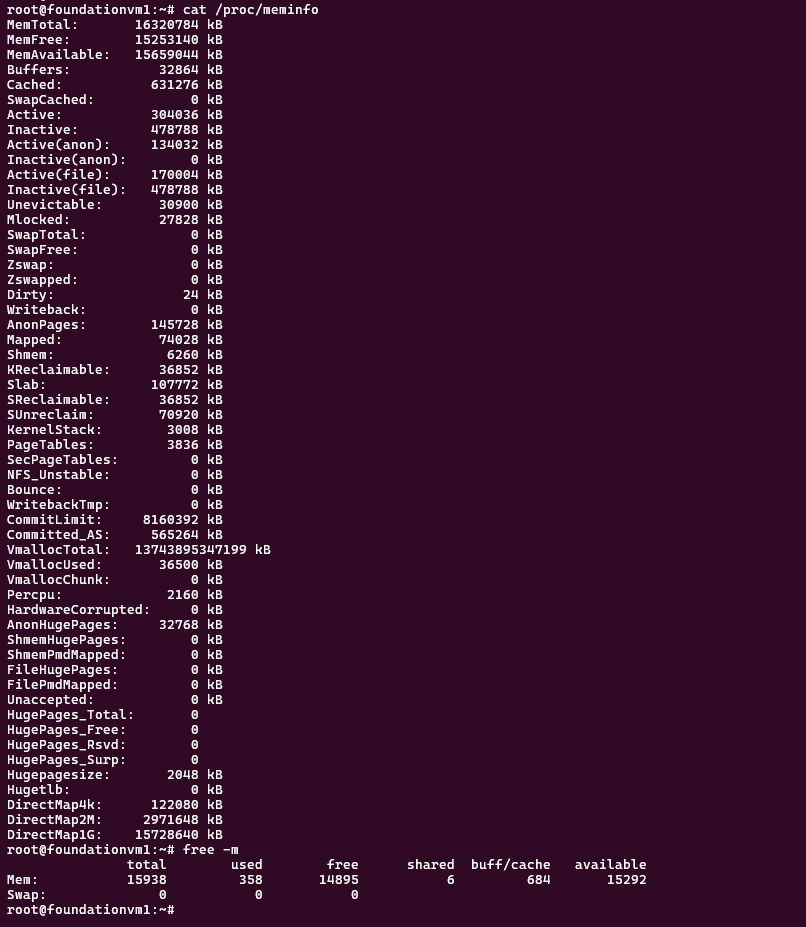
  </details>

  > Notice sudo may or may not ask for your password depending in the sudoers configuration

Step 4: Using top
- Using the command ```top``` get utilization information from foundationvm1
  ``` bash
  top
  ```
  <details>
    <summary>Screenshot: Executing top</summary>

	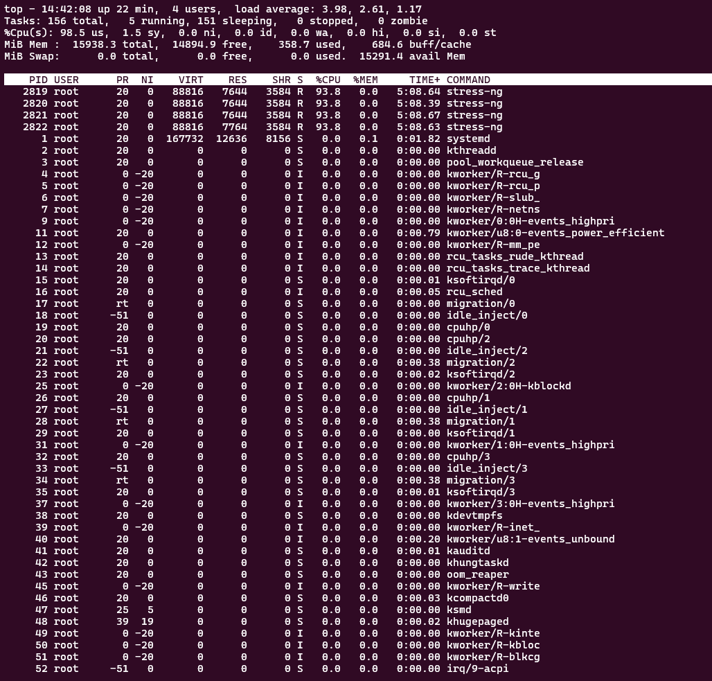
  </details>

  > Notice the PID number that is associated with each stress process as well as check the %CPU with the CPU consumption details. Those are the top CPU consumers at this moment.

  > If during the execution of the top the key "1" is pressed, the top will display a more elaborate information for each CPU on the system.

Step 5: Listing processes
- Using the commands ```ps``` and ```pgrep``` list the running processes on the system
  ``` bash
  ps -ef
  ps aux
  pgrep
  ```
  <details>
    <summary>Screenshot: Listing processes</summary>

	
  </details>

   | The ps accepts several kinds of options: |
   |------------------------------------------|
   | UNIX options, which may be grouped and must be preceded by a dash.
   BSD options, which may be grouped and must not be used with a dash.
   GNU long options, which are preceded by two dashes. |

   
## Lab 5 - File permissions and ownership

### About Lab 5

- It will take approximately 20 minutes.
- This lab provides hands-on activities.
- After this lab you will be able to:

  - Read file and direcotries permissions.
  - Modify permissions on files and directories.
  - Modify user and group ownership of files and directories.
  - Manage special attributes to files in Linux. 

### Scenario 1: Modify file and directory permissions

#### Instructions Lab 5 Scenario 1

Step 1: Create a directory
- Using the VM foundationvm1 from the previous lab1. Create a directory called ```data``` under your home directory with following command.
  ``` bash
  mkdir ~/data
  ```

Step 2: Create a file
- Create a file called ```filename.txt``` inside the directory ```~/data``` and review its permissions.
  ``` bash
  cd ~/data
  touch filename.txt
  ls -l filename.txt
  ```

Step 3: Set the permissions
- Ensure the starting premissions are read, write, execute for you (owner), you can choose to execute one of the following two commands as both do the same thing.
  ``` bash
  chmod -v u=rwx,g=,o= filename.txt
  chmod 700 filename.txt
  ```

Step 4: Check the permissions
- Verify that your user has read,write and execute permissions on the file, while groups and other do not have any permisos.
  ``` bash
  ls -l filename.txt
  ```

Step 5: Change permissions
- Modify the filename.txt permissions again by adding read an write permissions to the group and read only access to other users. Again you can choose to execute any of the following two command as both do the same thing.
  ``` bash
  chmod -v g+rw,o+r filename.txt
  chmod 764 filename.txt
  ```

### Scenario 2: Modify file and directory ownership

#### Instructions Lab 5 Scenario 2 

Step 1: Create a new directory
- Using the VM foundationvm1 from the previous lab1, make sure you are in your user home directory. If you are not there, you can change the directory by typing.
  ``` bash
  pwd
  cd ~
  mkdir ~/newdir
  ```

Step 2: Change ownership of the directory
- Check the permissions of ```~/newdir``` and then change the ownership.
  ``` bash
  ls -ld ~/newdir
  sudo chown root ~/newdir
  ```

Step 3: List the changes
- After the change, check on the differences.
  ```bash
  sudo -ls -ld ~/newdir
  ```

Step 4: Change group ownership
- Same as user ownership, change the group ownership of the directory. Check the results
  ``` bash
  sudo chgrp root ~/newdir
  sudo ls -ld ~/newdir
  ```

Step 5: Another way to change user and group ownership
- The command chown can change ownership for user and group of a file in a single command:
  ```bash
  sudo chown root:root ~/newdir
  ```

### Scenario 3: Special permissions

#### Instructions Lab 5 Scenario 3 

Step 1: Using the VM foundationvm1 create a file ```special.sh```
- Using the root command, create the file ```special.sh``` and check the permissions
  ``` bash
  sudo -i
  touch special.sh
  ls -l special.sh
  ```

Step 2: Set special permission
- Set SUID permission for the file ```special.sh``` and verify the permission.
  ``` bash
  chmod u+s special.sh
  ls -l special.sh
  ```
  A file that has SUID permission by default is ```/etc/passwd```, you can check on it with command.
  ``` bash
  ls -l /bin/passwd
  ```

Step 3: Set special permission
- Set SGID permission for the file ```special.sh``` and verify the permission:
  ``` bash
  chmod g+s special.sh
  ls -l special.sh
  ```
  There are files that has SGID permission by default, but those depends on the distribution you're currently working you can find them with the following command.
  ``` bash
  find / -user root -perm -2000 -exec ls -ldb {} \;
  ```

Step 4: Create a new folder
- Create a new folder with name ```common``` and verify the permission
  ```bash
  mkdir common
  ls -ld common
  ```

Step 5: Add the sticky bit to the folder
- Set sticky bit permission to the directory ```common``` and verify the permission
  ``` bash
  chmod o+t common
  ls -ld common
  ```
  A folder with sticky bit permission by default is /tmp, you can check on it with command: 
  ``` bash
  ls -ld /tmp
  ```

[Return to main menu](https://github.com/mitchcr/specialist/blob/main/README.md)
