[[_TOC_]]

# Module 3 - Package Management Laboratories

##  Lab 8 - Package Management

### About this lab

- It will take approximately 40 minutes.
- This lab provides hands-on activities.
- After this lab you will be able to
  - How to use rpm to manage packages by doing simple commands that will let you query and check packages, and how to rebuild the rpm database in case of corruption.  In other words, you will be using rpm as a method to check packages installed or to be installed in a Linux system.
  - How to use the dnf utility, used in rpm-based distributions like Red Hat or Rocky Linux systems, that will let you query, install, update and check packages.  You will also download packages without installing them for later use or for transferring to other systems.
  - How to use dpkg, used in Debian-based distributions like Ubuntu Linux system, to check packages installed or to be installed in a Linux system.
  - How to use the apt utility, used in Debian-based systems taht will let you query, install, and check packages. 
  - How to use the zypper utility, used in SuSE and OpenSuSE distributions, that can be used to install, update, remove software and manage repositories.

### Scenario 1: Using rpm

#### Instructions Lab 8 Scenario 1

Step 1: Connecting to the VM  Lab 8 Scenario 1
- Login in to the VM created in Lab 1 called foundationsvm2 and swith to root account
  ``` bash
  sudo -i 
  ```
  <details>
    <summary>Screenshot: switch to root account</summary>

	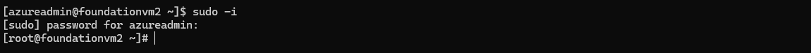
  </details>

Step 2: Package manager file locator with rpm
- Identify from which package the file ```/etc/logrotate.conf``` belongs
  ``` bash
  rpm -qf /etc/logrotate.conf
  ```
  <details>
    <summary>Screenshot: finding what package a file belongs to</summary>

	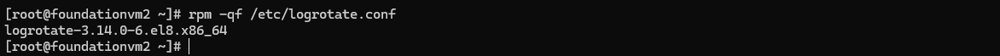
  </details>

Step 3: Show package information with rpm
- List information about the same package above, including all the files it contains
  ``` bash
  rpm -qil logrotate
  ```
  <details>
    <summary>Screenshot: finding information on a package</summary>

	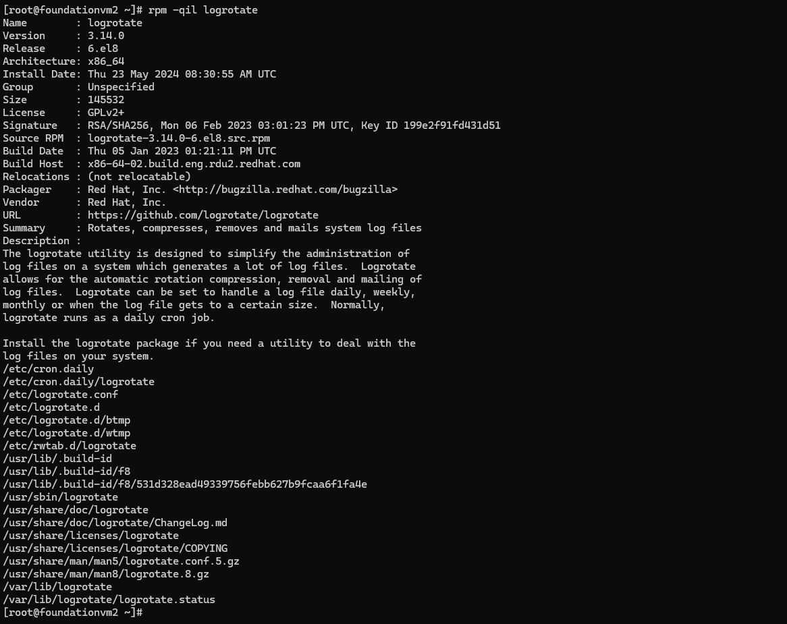
  </details>

Step 4: Removing packages with rpm
- Try to remove the package ```logrotate```
  ``` bash
  rpm -e logrotate
  ```
  <details>
    <summary>Screenshot: removing a package</summary>

	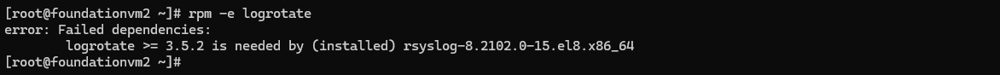
  </details>

Step 5: Listing packages with rpm
- Get a list of all rpms in the system and save a copy of the output
  ``` bash
  rpm -qa > /var/tmp/package_list
  rpm -qa
  ```
  <details>
    <summary>Screenshot: listing all rpms in system and save the outputs</summary>

	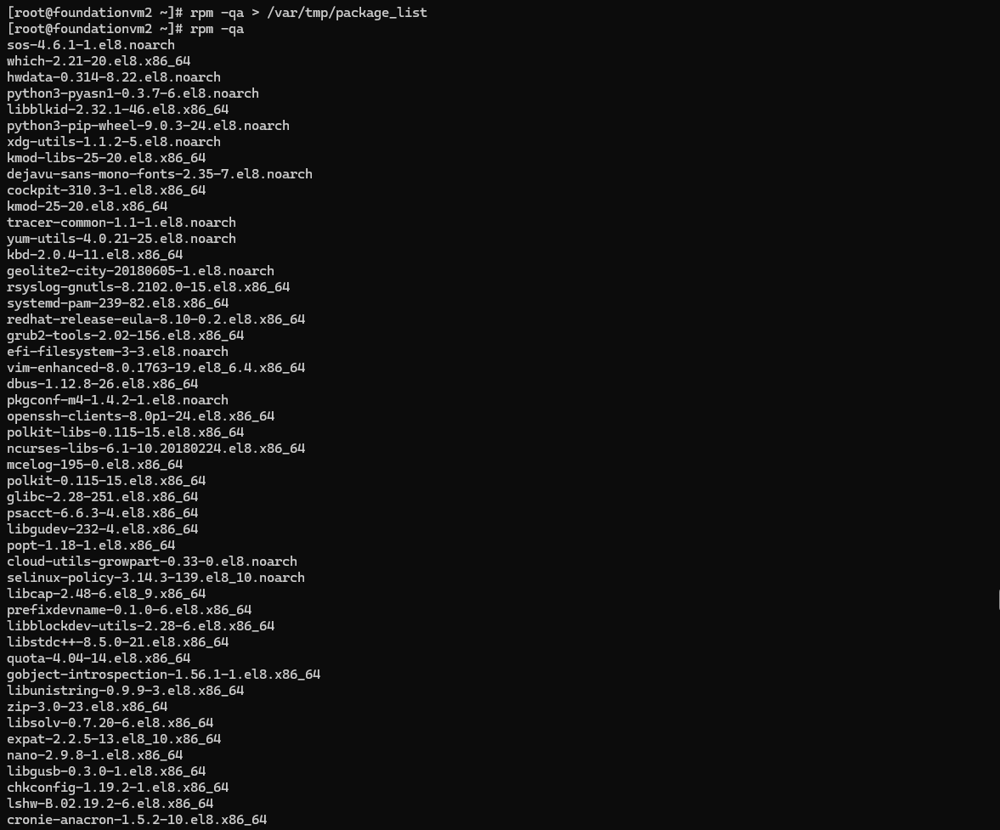
  </details>

Step 6: Making a backup of the rpm database
- Backup up the contents of /var/lib/rpm
  ``` bash
  cp -a /var/lib/rpm /var/lib/rpm_backup
  ```
  <details>
    <summary>Screenshot: copying a directory</summary>

	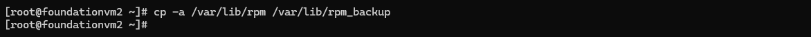
  </details>

Step 7: Rebuliding the rpm database
- Using ```rpm``` command, rebuild the rpm database
  ``` bash
  rpm --rebuilddb
  ```
  <details>
    <summary>Screenshot: rebuilding rpm database</summary>

	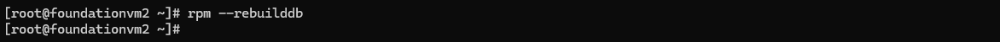
  </details>

Step 8: Compare new and backup rpm database folders
- Compare the new directory contents with the backup; avoid inspecting the binary file contents, but record the number and names of the files
  ``` bash
  diff -bur /var/lib/rpm /var/lib/rpm_backup
  ls -l /var/lib/rpm | wc -l
  ls -l /var/lib/rpm_backup | wc -l 
  ```
  <details>
    <summary>Screenshot: comparing directories contents</summary>

	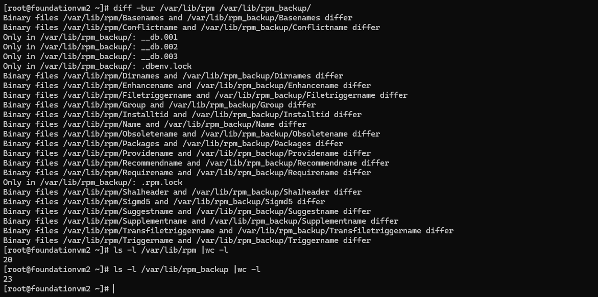
  </details>

Step 9: Listing all installed packages with rpm
- List all RPMs on the system. Compare this new list with one generated before the rebuild procedure.
  ``` bash
  rpm -qa | tee /var/tmp/package_list_new
  diff /var/tmp/package_list /var/tmp/package_list_new
  ```
  <details>
    <summary>Screenshot: listing all rpms in system and save the output </summary>

	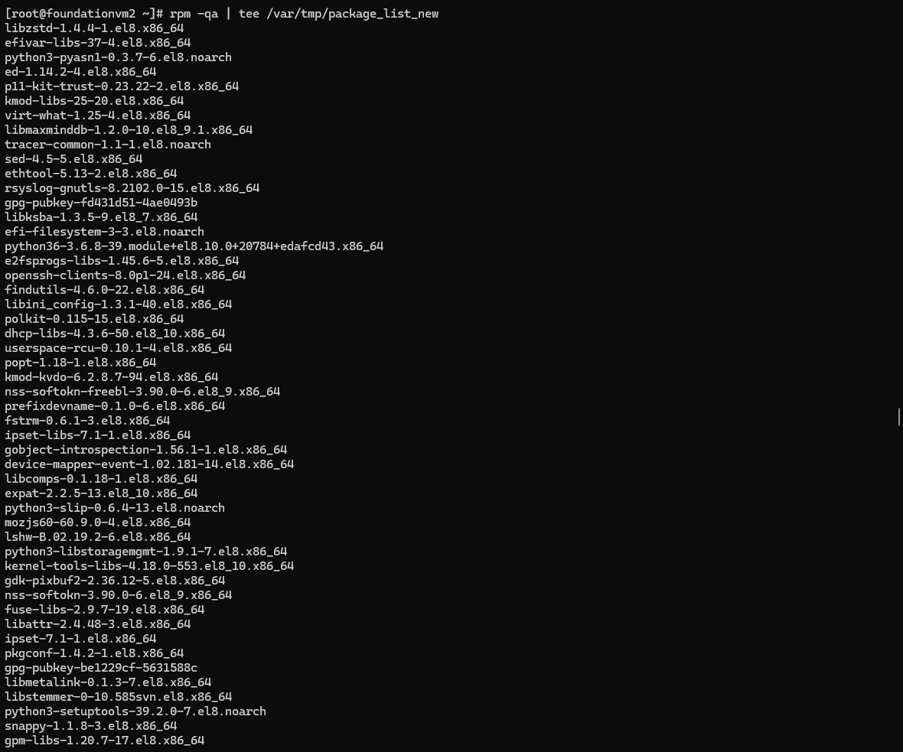
  </details>
  <details>
    <summary>Screenshot: comparing file contents</summary>

	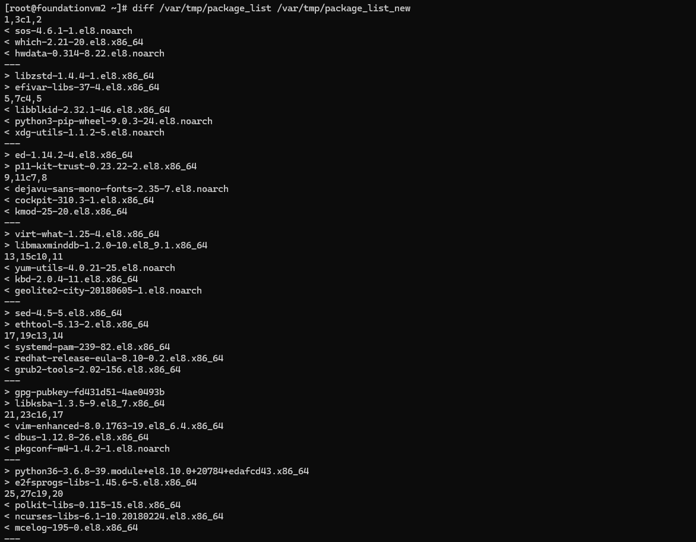
  </details>

Step 10: Delete the rpm database backup
- You may delete the backup (around 100 MB), but consider keeping it temporarily to ensure system stability before removal
  ``` bash
  rm -rf /var/lib/rpm_backup
  ```
  <details>
    <summary>Screenshot: delete directory</summary>

	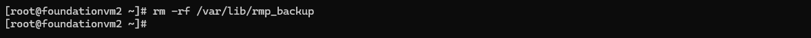
  </details>

### Scenario 2: Using yum

#### Instructions Lab 8 Scenario 2

**Note**:  All the images included in this lab are examples and outputs can change, please check on your VM outputs and focus on them. 

Step 1: Connecting to the VM  Lab 8 Scenario 2
- Use the VM created in Lab 1 called foundationsvm2. If you're not connected, please connect to it and switch to root account. 
  ``` bash
  sudo -i 
  ```
  <details>
    <summary>Screenshot: switch to root account</summary>

	
  </details>

Step 2: Check updates with yum
- Check to see if there are any available updates for your system
  ``` bash
  yum update
  yum check-update
  yum list updates
  ```
  <details>
    <summary>Screenshot: list available updates.</summary>

	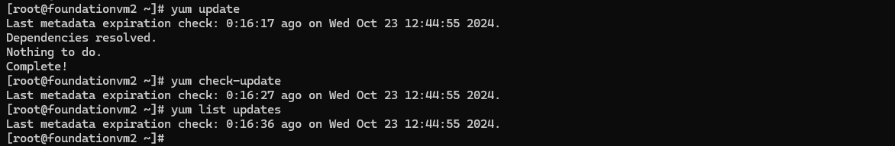
  </details>

  **Note**: Using the first command, the system will prompt to apply pending updates. Abort with ```N``` to continue executing the remaining commands 

Step 3: Update an specific package with yum
- You can indiviually update a package
  ``` bash 
  yum update bash
  ```
  <details>
    <summary>Screenshot: update a package.</summary>

	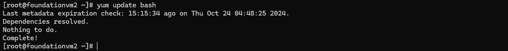
  </details>

Step 4: Listing specific packages with yum
- List all installed kernel-related packages, and list all installed and available
  ``` bash
  yum list installed "kernel"
  yum list "kernel*"
  ```
  <details>
    <summary>Screenshot: search for installed and available package.</summary>

	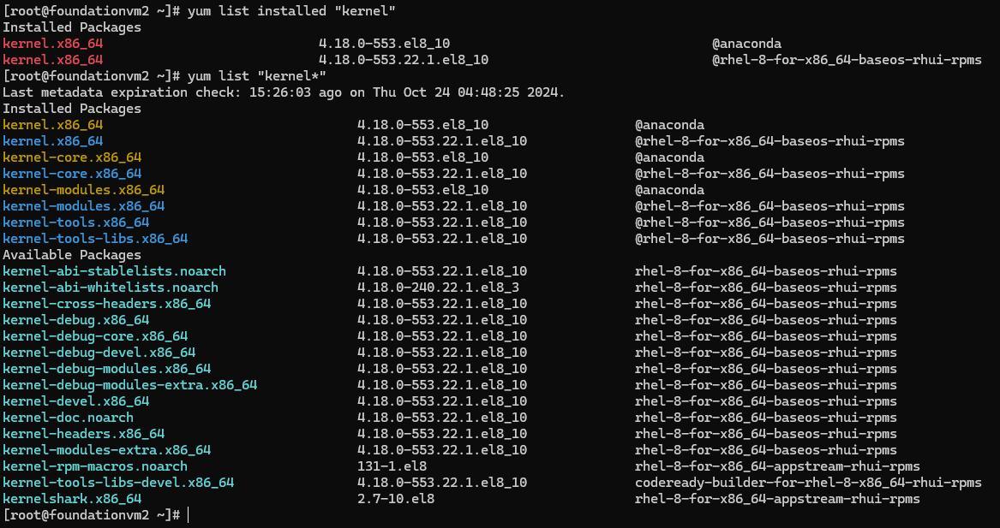
  </details>

Step 5: Installing a package with yum
- Install the ```httpd-devel``` package or any missing packages. Use ```yum list``` to view all available packages; consider using a wildcard to narrow down the list
  ``` bash
  yum install httpd-devel -y  # The -y will be accepting with a "yes" all the questions the yum install command make
  ```
  <details>
    <summary>Screenshot: start of the command execution.</summary>

	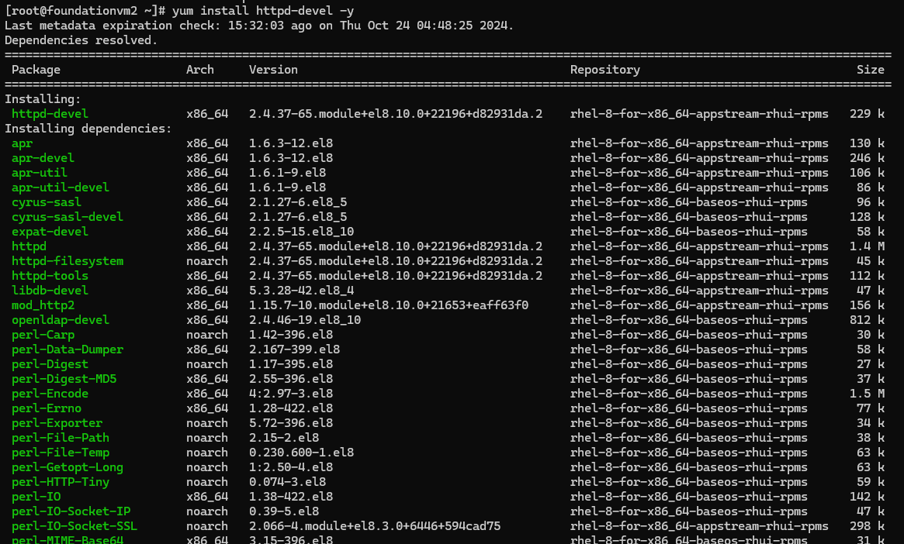
  </details>

Step 6: Removing a package with yum
- Remove the ```httpd-devel``` package and packages that were installed as dependencies
  ``` bash
  yum remove httpd-devel -y
  ```
  <details>
    <summary>Screenshot: start of the command execution.</summary>

	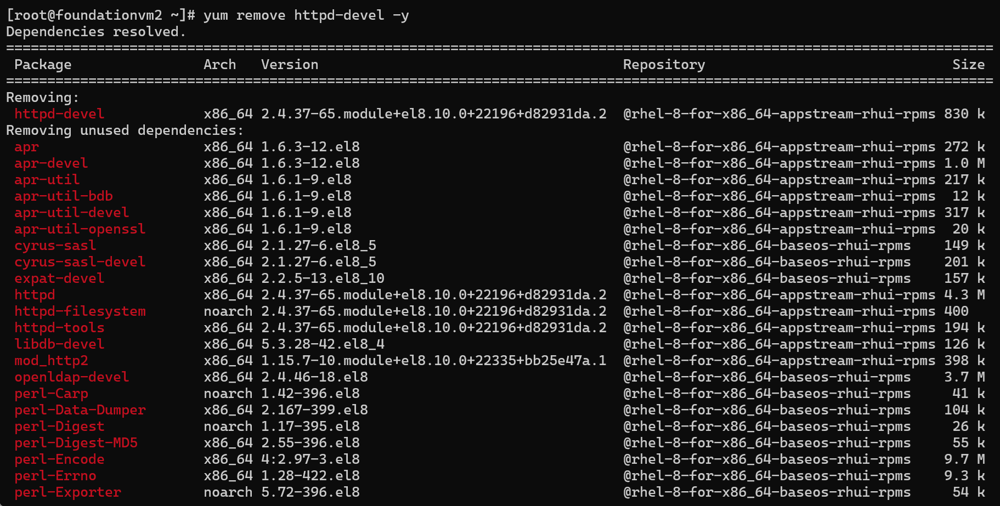
  </details>

Step 7: Search a package with yum
- Use the ```yum``` command, not ```rpm```, to find all packages with ‘bash’ in their name or description.
  ``` bash
  yum search bash
  ```
  <details>
    <summary>Screenshot: find a package using references.</summary>

	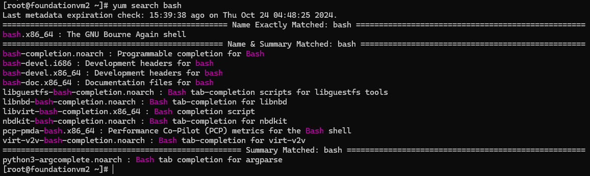
  </details>

Step 8: Find installed and available Packages with yum
- Use the yum command, not rpm, to find all installed and available bash packages
  ``` bash
  yum list bash
  ```
  <details>
    <summary>Screenshot: list available packages.</summary>

	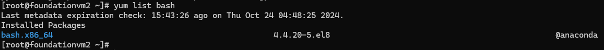
  </details>

Step 9: Get package information with yum
- Using ```yum``` command get the information for a specific package
  ``` bash
  yum info bash
  ```
  <details>
    <summary>Screenshot: get package information.</summary>

	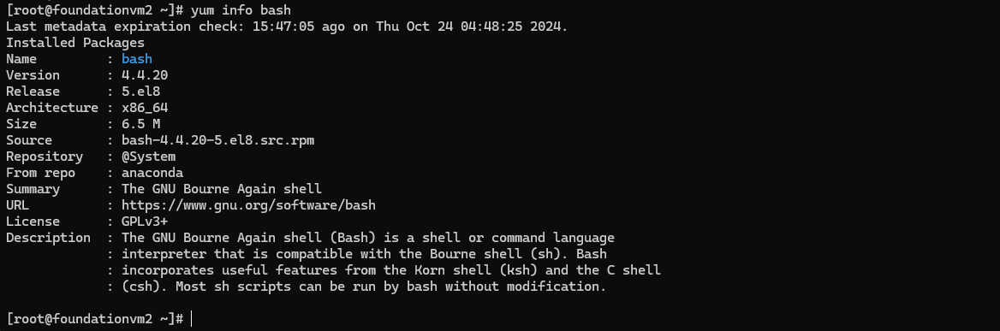
  </details>

Step 10: Finding pacakge dependencies with yum
- Display the dependencies for the bash package
  ``` bash
  yum deplist bash
  ```
  <details>
    <summary>Screenshot: display package dependencies.</summary>

	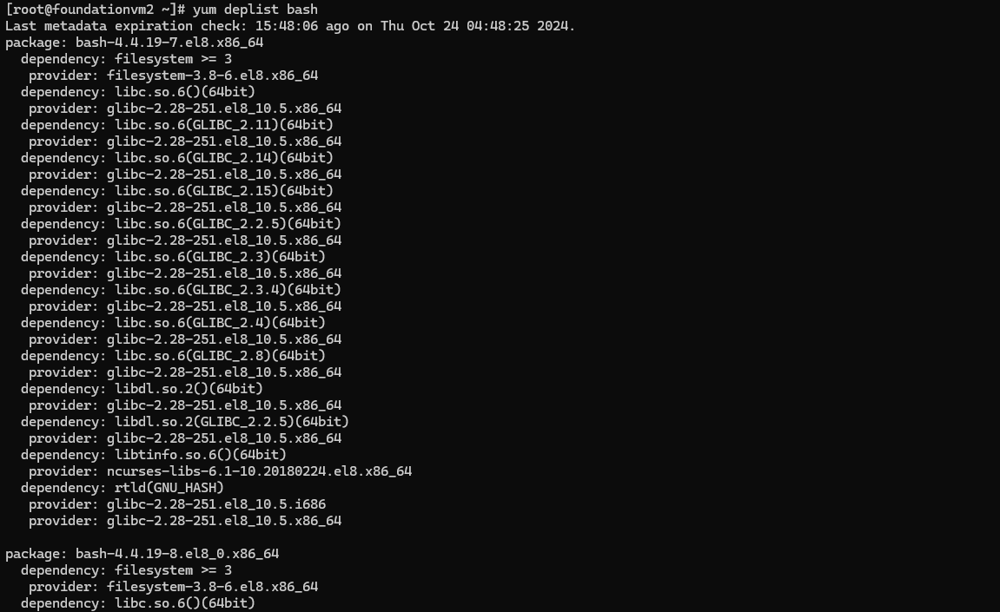
  </details>


Step 11: Elevated permissions for yum
- Test the commands both root (using sudo) and regular user (without sudo). Do you notice any difference?
  ``` bash
  sudo yum info bash
  yum info bash
  sudo yum list bash
  yum list bash
  ```
  <details>
    <summary>Screenshot: executing yum commands with normal user.</summary>

	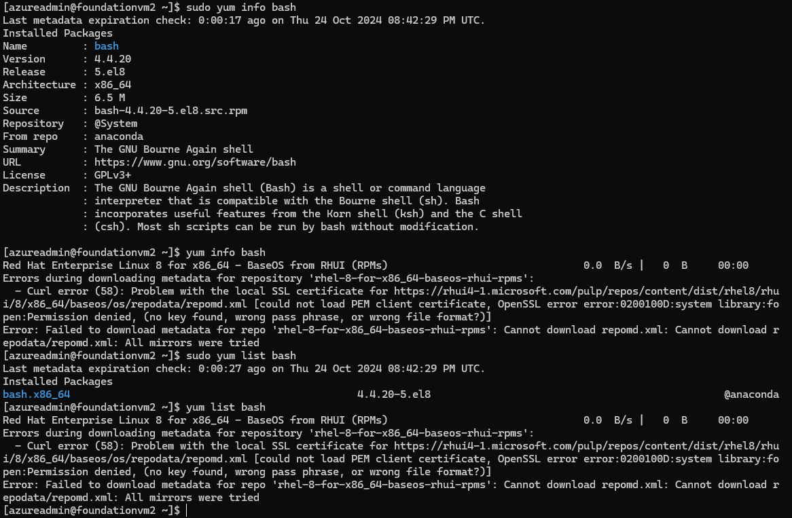
  </details>

Step 12: Additional yum utilies
- Install the yum-utils package
  ``` bash
  sudo yum install yum-utils -y
  ```
  <details>
    <summary>Screenshot: installing a package using normal user.</summary>

	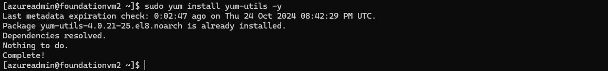
  </details>

Step 13: Download a package file with yumdownloader
- It is possible to download a package without installing it
  ``` bash
  sudo yumdownloader xterm   #xterm is the name of the package
  ```
  <details>
    <summary>Screenshot: downloading a package without installing it.</summary>

	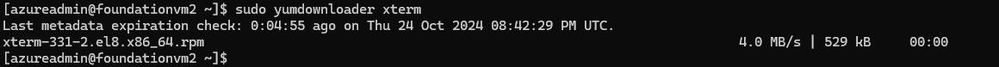
  </details>

Step 14: Installing a downloaded package with yum
- Use ```yum``` to install the *xterm* package, using the file you downloaded in previous step
  ``` bash
  sudo yum localinstall $(pwd)/xterm-*.rpm -y
  ```
  <details>
    <summary>Screenshot: installing a local package, start of the command</summary>

	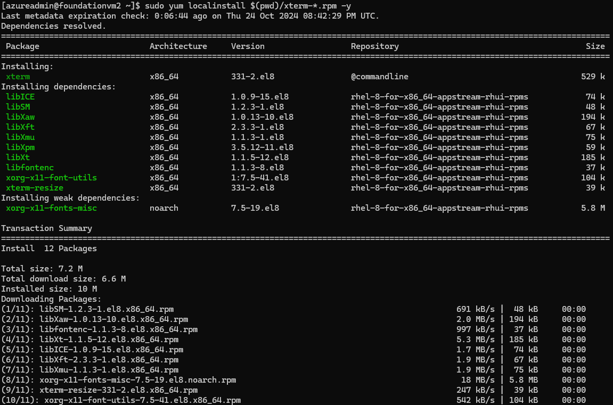
  </details>

###  Scenario 3: Using dpkg

#### Deployment Lab 8 Scenario 3

Step 1: Deploy an Ubuntu VM
- Using the link below, please fill the required options identified with a `*`. Use this new VM for this lab.

  [](https://labboxprod.azurewebsites.net/api/Labbox?url=https://dev.azure.com/linuxninjas/azure%20linux%20academy%20-%20css/_git/azurelinuxacademy?path=/azure%20linux%20academy/azure_linux_foundation/module%203%20-%20package%20management/labs/lab08ubuntu.json)  


#### Instructions Lab 8 Scenario 3

Step 1: Connecting to the VM for Lab 8 Scenario 3
- Connect to the *lab8ubuntu* VM using the azureuser account and password you used during the creation of the VM. Then, switch to root account
  ``` bash
  sudo -i 
  ```
  <details>
    <summary>Screenshot: connecting to Ubuntu VM and switch to root</summary>

	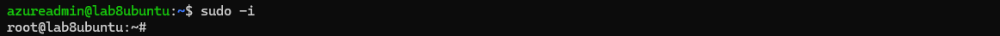
  </details>

Step 2: Package manager file locator with dpkg
- Identify from which package the file ```/etc/sos/sos.conf``` belongs
  ``` bash
  dpkg -S /etc/sos/sos.conf
  ```
  <details>
    <summary>Screenshot: package management</summary>

	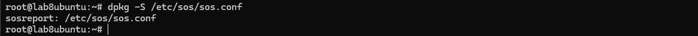
  </details>

Step 3: Show package information with dpkg
- List information about that package including all the files it contains
  ``` bash
  dpkg -l sosreport
  dpkg -L sosreport
  ```
  <details>
    <summary>Screenshot: package management (not the completed output)</summary>

	
  </details>

Step 4: Removing packages with dpkg
- Try to remove the package
  ``` bash
  dpkg -r sosreport
  ```
  <details>
    <summary>Screenshot: remove a package</summary>

	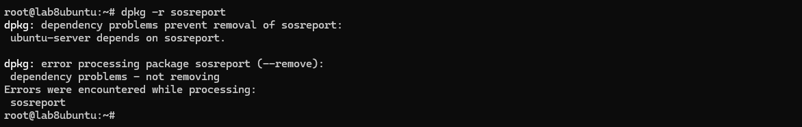
  </details>

Step 5: Listing packages with dpkg
- List all packages installed withing the system
  ``` bash
  dpkg -l 
  ```
  <details>
    <summary>Screenshot: list installed packages (not the complete output)</summary>

	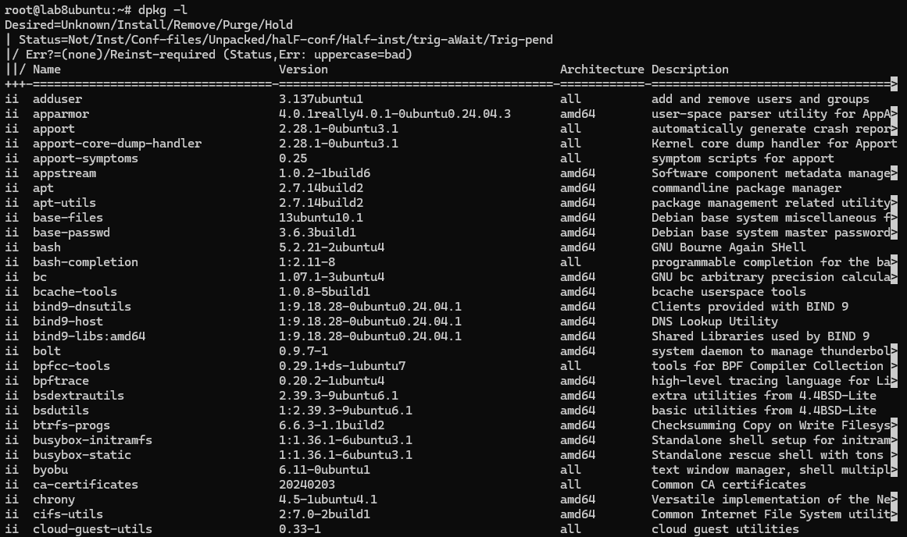
  </details>

Step 6: Verify installed packages with dpkg
- Check if *xauth* is installed within the system
  ``` bash
  dpkg -l |grep xauth 
  ```
  <details>
    <summary>Screenshot: search for an installed package</summary>

	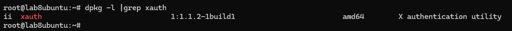
  </details>


###  Scenario 4: Using apt

#### Instructions Lab 8 Scenario 4

Step 1: Connecting to the VM with apt
- For this lab we're going to continue using the *lab08ubuntu* VM created in previous lab. Connect to it using SSH protocol and switch to root account
  ``` bash
  sudo -i 
  ```
  <details>
    <summary>Screenshot: connecting to Ubuntu VM and switch to root</summary>

	
  </details>

Step 2: Updating the package index files with apt
- Update the list for all the packages that could be installed
  ``` bash
  apt-get update
  ```
  <details>
    <summary>Screenshot: update package list</summary>

	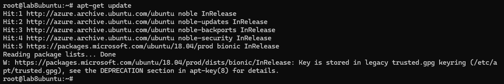
  </details>

Step 3: Updating installed packages with apt
- Update all packages that might be out of date withing your system
  ``` bash
  apt-get upgrade
  ```
  <details>
    <summary>Screenshot: upgrade packages</summary>

	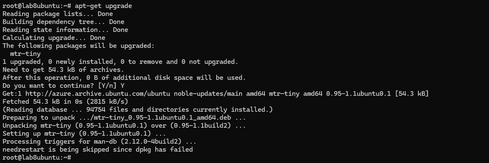
  </details>

Step 4: Removing non required packages with apt
- Remove all packages that were installed as dependencies and no longer needed
  ``` bash
  apt-get autoremove
  ```
  <details>
    <summary>Screenshot: remove packages no longer needed</summary>

	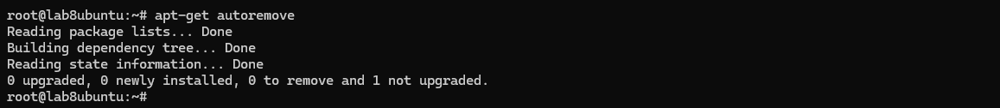
  </details>

Step 5: Installing a package with apt
- Install the package ```nmap```
  ``` bash
  apt-get install nmap -y
  ```
  <details>
    <summary>Screenshot: install a package (not all the output in the screenshot)</summary>

	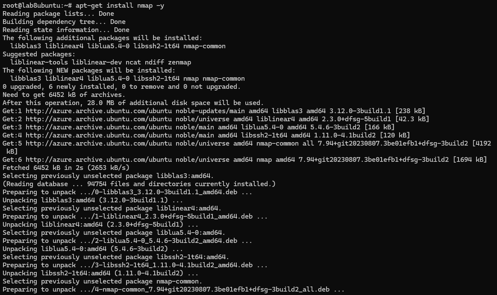
  </details>

Step 6: Removing a package with apt
- Remove the ```nmap``` package without removing its configuration files
  ``` bash
  apt-get remove nmap -y
  ```
  <details>
    <summary>Screenshot: remove a package</summary>

	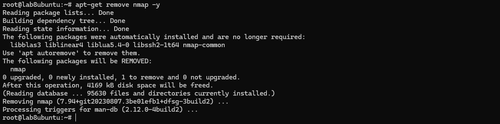
  </details>

Step 7: Reinstalling a package non-interactively with apt
- Reinstall the ```nmap``` package, this is not going to ask for confirmation or any other question, it will answer ```yes``` to all
  ``` bash
  apt-get install nmap -y
  ```
  <details>
    <summary>Screenshot: install a package (not all the output in the screenshot)</summary>

	
  </details>

Step 8: Removing a package with its configuration files with apt
- Completely get rid of the ```nmap``` package along with its configuration files.
  ``` bash
  apt-get purge nmap -y
  ```
  or
  ``` bash
  apt-get remove nmap --remove -y
  ```
  <details>
    <summary>Screenshot: remove a package with purge</summary>

	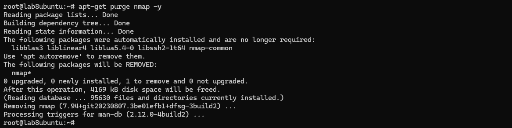
  </details>
  <details>
    <summary>Screenshot: remove a package with remove</summary>

	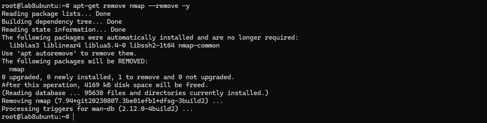
  </details>

  **Note**: Using autoremove might be required as well to remove all the package left that were installed as dependencies

Step 9: Checking the changelog of a package with apt
- Check the changes (changelog) that have been made for the ```nmap``` package
  ``` bash
  apt-get changelog nmap
  ```
  <details>
    <summary>Screenshot: get a package change log (start of the file)</summary>

	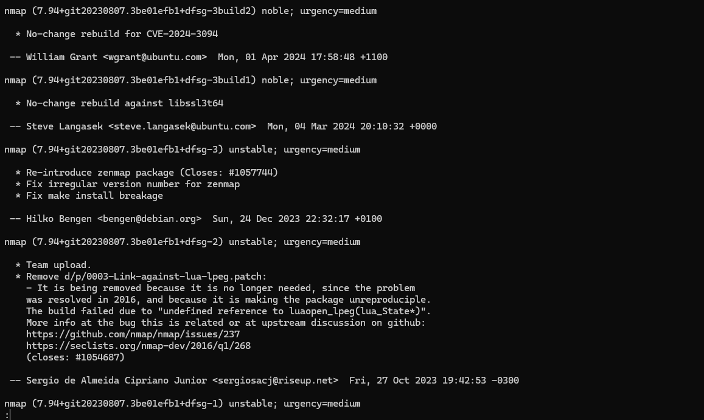
  </details>

  **Note**: The package doesn't need to be installed and to go out of the change log you can use lower case letter q.

Step 10: Making a full system upgrade with apt
- Perform a full system upgrade, including handling complex dependency changes, while automatically confirming all prompts
  ``` bash
  apt-get dist-upgrade -y
  ```
  <details>
    <summary>Screenshot: get a package change log (start of the file)</summary>

	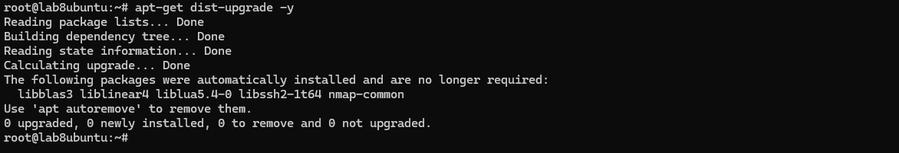
  </details>

   **Note**: This is not going to do a major version upgrade.

###  Scenario 5: Using zypper

#### Deployment Lab 8 Scenario 5

Step 1: Deploy an SLES VM
- Using the link below, please fill the required options identified with a `*`. Use this new VM for this lab.

  [](https://labboxprod.azurewebsites.net/api/Labbox?url=https://dev.azure.com/linuxninjas/azure%20linux%20academy%20-%20css/_git/azurelinuxacademy?path=/azure%20linux%20academy/azure_linux_foundation/module%203%20-%20package%20management/labs/lab08sles.json)

#### Instructions Lab 8 Scenario 5

Step 1: Connecting to the VM
- Connect to the *lab8sles* VM using the azureuser account and password you provided. Then, please switch to root account
  ``` bash
  sudo -i 
  ```
  <details>
    <summary>Screenshot: connecting to SuSE VM and switch to root</summary>

	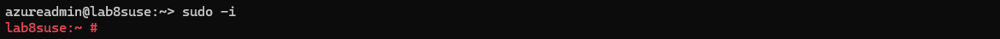
  </details>

Step 2: Search a package with zypper
- Search for the package ```nmap``` before installing it
  ``` bash
  zypper se nmap
  ```
  <details>
    <summary>Screenshot: search for a package</summary>

	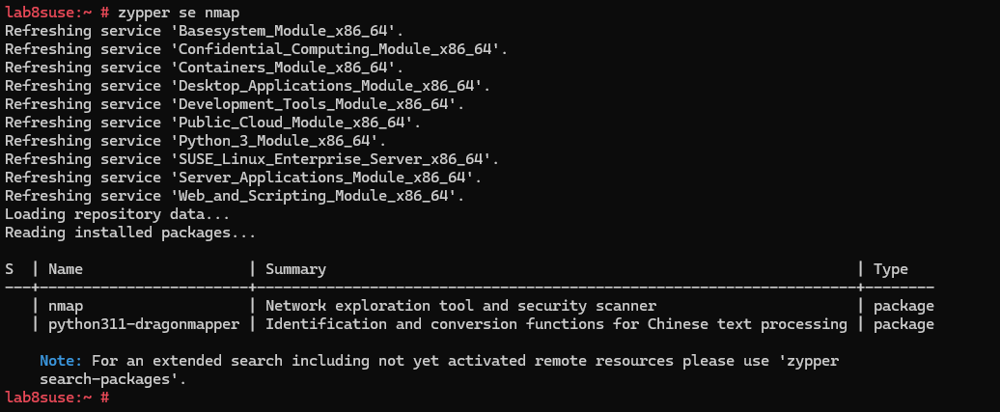
  </details>

Step 3: Listing repositories with zypper
- Get the list of the defined repositories
  ``` bash
  zypper lr
  ```
  <details>
    <summary>Screenshot: list repositories (first part of the command)</summary>

	
  </details>

Step 4: Installing a package with zypper
- Install ```nmap``` package, this will install any required dependencies
  ``` bash
  zypper in nmap
  ```
  <details>
    <summary>Screenshot: install a package</summary>

	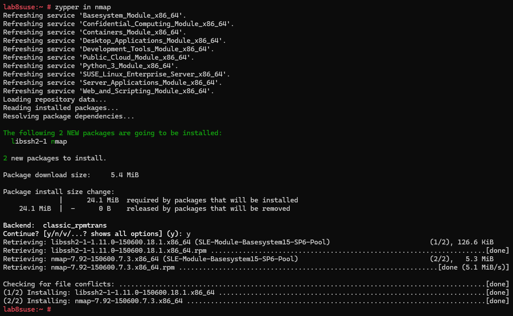
  </details>

Step 5: Removing packages with zypper
- Remove the ```nmap``` package
  ``` bash
  zypper rm nmap
  ```
  <details>
    <summary>Screenshot: remove a package</summary>

	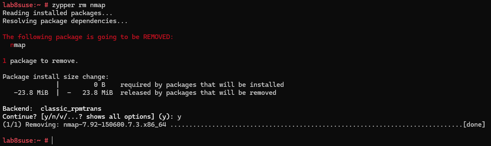
  </details>

Step 6: Updating packages with zypper
- Update all installed packages to their latest available versions
  ``` bash
  zypper up
  ```
  <details>
    <summary>Screenshot: update installed packages (start of the command)</summary>

	
  </details>

Step 7: Reinstalling a package non-interactively with zypper
- Install the ```nmap``` package again but without interaction of the user
  ``` bash
  zypper --non-interactive in nmap
  ```
  <details>
    <summary>Screenshot: install a package</summary>

	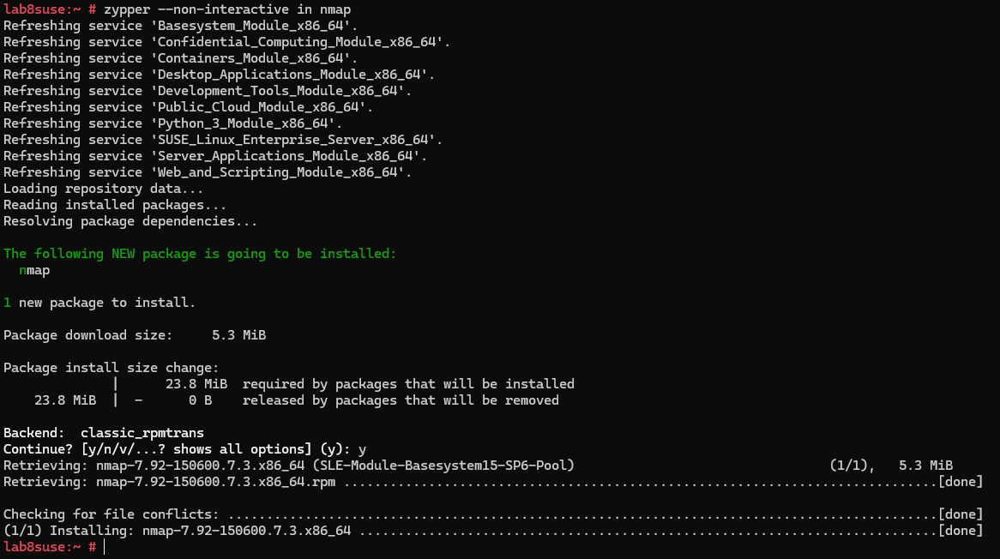
  </details>

Step 8: Removing a package  non-interactively with zypper
- Remove the ```nmap``` package without interaction of the user
  ``` bash
  zypper --non-interactive rm nmap
  ```
  <details>
    <summary>Screenshot: remove a package</summary>

	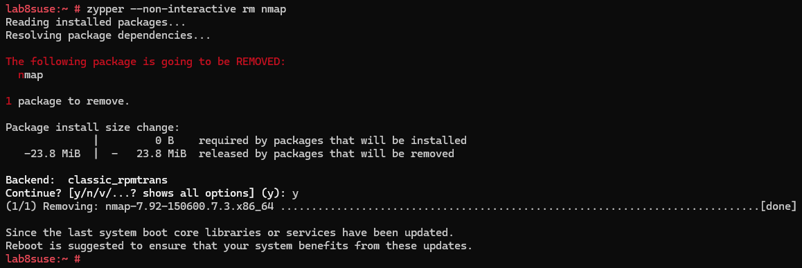
  </details>

Step 9: Clean Zypper package cache downloads with zypper
- Clean zypper, this will clean the cache of downloaded packages
  ``` bash
  zypper clean
  ```
  <details>
    <summary>Screenshot: clean cache</summary>

	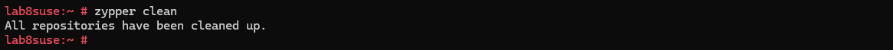
  </details>

Step 10: Clean Zypper metadata and package caches with zypper
- Clean zypper using ```-a```, this will include metadata, packages, and repository data that have been downloaded and stored locally
  ``` bash
  zypper clean -a
  ```
  <details>
    <summary>Screenshot: clean cache and metadata</summary>

	
  </details>

Step 11: Upgrade the SuSE distribution with zypper
- Upgrade all installed packages to their latest available versions.
  ``` bash
  zypper dist-upgrade
  ```
  <details>
    <summary>Screenshot: upgrade the distribution (beginning of the command)</summary>

	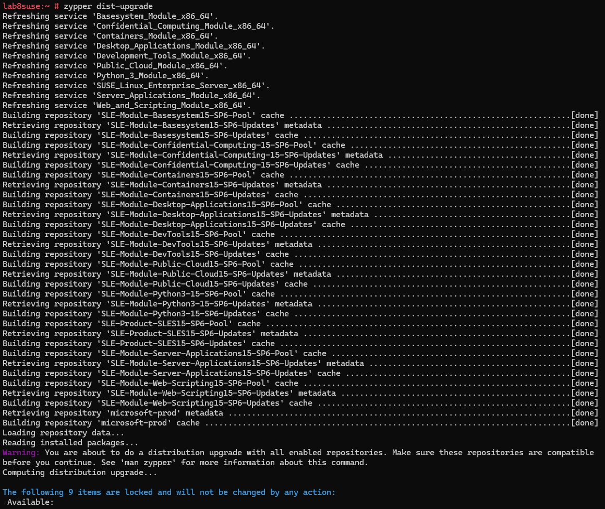
  </details>

  **Note**: The ```zypper update``` refreshes all installed packages to their latest versions, while ```zypper upgrade``` also handles dependency changes and can install or remove packages as needed.

[Return to main menu](https://github.com/mitchcr/specialist/blob/main/README.md)
