## Lab 11 - Storage Management

### About this lab

- These laboratories will take approximately 90 minutes.
- This lab provides hands-on activities.
- After this lab you will be able to
  - How to identify a disk using its LUN ID
  - How to create partitions on a disk
  - How to format a block device
  - Mount a filesystem and make this a permanent change
  - Understand and use the Logical Volume Manager on Linux

### Scenario 1: Creating a new filesystem using a MBR partition

#### Overview Lab 11 Scenario 1

- In this scenario, the required structure will be created in first data disk (LUN 0) attached to hold a new filesystem.
- Use ```lsblk```, ```blkid``` and the list of the directory ```/dev/disk/azure``` to determinate the correct block device and relationship against the LUN ID.
- Make a new ext4 filesystem permanent across reboots, understand the basic format of the file ```/etc/fstab```
- Public documentation [Add a disk to a Linux VM](https://learn.microsoft.com/azure/virtual-machines/linux/add-disk)

#### Deployment Lab 11 Scenario 1

Step 1: Deploy an SLES VM
- Using the link below, please fill the required options identified with a `*`. Use this new VM for this lab.

  [](https://labboxprod.azurewebsites.net/api/Labbox?url=https://dev.azure.com/linuxninjas/azure%20linux%20academy%20-%20css/_git/azurelinuxacademy?path=/azure%20linux%20academy/azure_linux_foundation/module%206%20-%20storage%20components/labs/lab11sles.json)

#### Instructions Lab 11 Scenario 1

Step 1: Connecting to the VM lab11sles
- Connect to the VM created in the previous step  and switch to root account
  ``` bash
  sudo -i 
  ```

Step 2: Identify the right disk
- This VM has been deployed with several data disks. Identify the LUN ID 0 using the commands ```lsblk``` and ```blkid```, and with the content of the directory ```/dev/disk/azure```, list and identify the attached disks.
  ``` bash
  lsblk -f # List all block devices including the filesystem information
  blkid # Print block device attributes
  ls -lR /dev/disk/azure # Recursively lists all symbolic links to block devices
  ```
  > **Note:** There is a symbolic link for each disk on the system, so the LUN ID 0 is represented with the file ```/dev/disk/azure/scsi1/lun0```. Also you can identify easily the OS disk identified as root and the resource disk.

  <details>
    <summary>Screenshot: Identify the disk LUN 0</summary>

	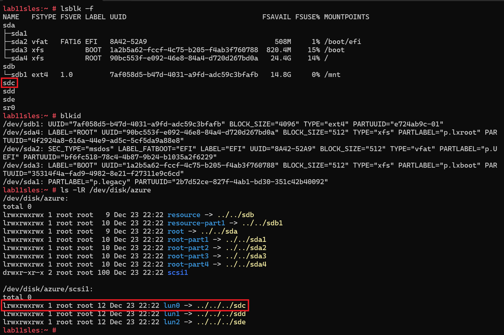
  </details> 

Step 3: Create a partition
- As found in the previous step for this system the ```lun0``` points to ```/dev/sdc```. Make sure to match your correct block device.

  > Remember the block devices ```/dev/sdX``` can point to a different disk between reboots

  ``` bash
  fdisk /dev/sdc
  ```
  > **Note:** The command fdisk is an interactive tool, so it's expecting commands to be enter. Here are some common actions. You can check the fdisk help using ```m```

  | Fdisk command | Action |  
  |-----------|:-----------:|  
  | n | Create new partition |
  | p | Choose partition type |
  | w | Write changes to disk | 
  | m | Display fdisk help |
  
  To create the required partition use these steps
    - New partition ```n```
    - Primary partition type, you could hit enter, this by default will select "p" or type ```p```
    - Partition number, again, there is a default value, in this case "1" or type ```1```
    - First sector, select a sector in the range printed, the default will be the first available sector
    - Last sector, select a sector in the range printed, the default will be the last available sector, which means the total of free space
    - Print partition table, using ```p```
    - Write changes to disk using ```w```
    
  <details>
    <summary>Screenshot: Create a new partition on disk LUN 0</summary>

	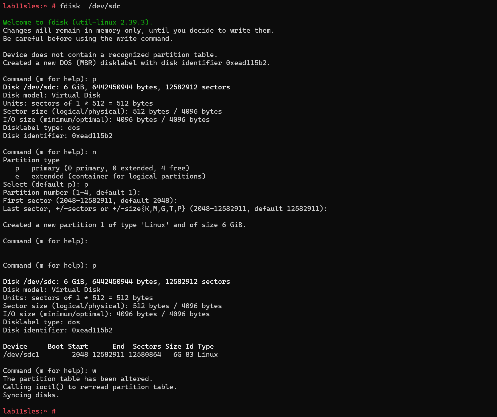
  </details> 

Step 4: Mounting a filesystem
- Creating a mountpoint ```/datadrive```, create a new filesystem on the block device and make the mount point permanent on ```/etc/fstab```
  ``` bash
  mkdir /datadrive # Creates the directory /datadrive
  mkfs.xfs /dev/sdc1 # Create a new XFS filesystem over the block device /dev/sdc1
  blkid /dev/sdc1 | This will return information about the block device and first created partition
  echo "$(blkid | grep /dev/sdc1 | awk '{print $2}') /datadrive xfs defaults,nofail 0 0" # This will print to screen the required line to mount this filesystem across reboots
  echo "$(blkid | grep /dev/sdc1 | awk '{print $2}') /datadrive xfs defaults,nofail 0 0" >> /etc/fstab # After checking previous line is correct, this line can be added to the end for the file /etc/fstab
  mount -a # Mount all filesystems
  df -h /datadrive # List filesystem utilization
  ```
    <details>
    <summary>Screenshot: Creating a new filesystem</summary>

	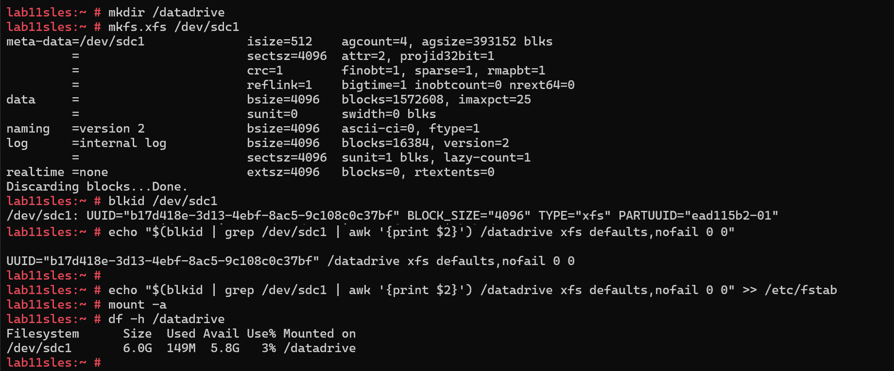
  </details> 

### Scenario 2: Create a new filesystem using LVM over a GPT partition

#### Overview Lab 11 Scenario 2

- In this scenario, the required LVM structure will be created in the second data disk with GPT, to hold a new ext4 filesystem
- Use ```lsblk```, ```blkid``` and the list of the directory ```/dev/disk/azure``` to determinate the correct block device and relationship against the LUN ID.
- Make a new ext4 filesystem permanent across reboots, understand the basic format of the file ```/etc/fstab```

#### Instructions Lab 11 Scenario 2

Step 1: Connecting to the VM lab11sles
- Connect to the VM created in the previous scenario and switch to root account
  ``` bash
  sudo -i 
  ```

Step 2: Identify the right disk
- This VM has been deployed with several data disks. Identify the LUN ID 1 using the commands ```lsblk``` and ```blkid```, and with the content of the directory ```/dev/disk/azure```, list and identify the attached disks.
  ``` bash
  lsblk -f # List all block devices including the filesystem information
  blkid # Print block device attributes
  ls -lR /dev/disk/azure # Recursively lists all symbolic links to block devices
  ```

  > **Note:** In this example the system was rebooted, now LUN 0 is using ```/dev/sdb```, and LUN 1 is using ```/dev/sdc```. This highlights the importance of not using the block devices ```/dev/sdX``` in ```/etc/fstab```

  > There is a symbolic link for each disk on the system, so the LUN ID 1 is represented with the file ```/dev/disk/azure/scsi1/lun1```. Also you can identify easily the OS disk identified as root and the resource disk.

  > All data disks are listed under the directory ```/dev/disk/azure/scsi1```

  <details>
    <summary>Screenshot: Identify the disk LUN 1</summary>

	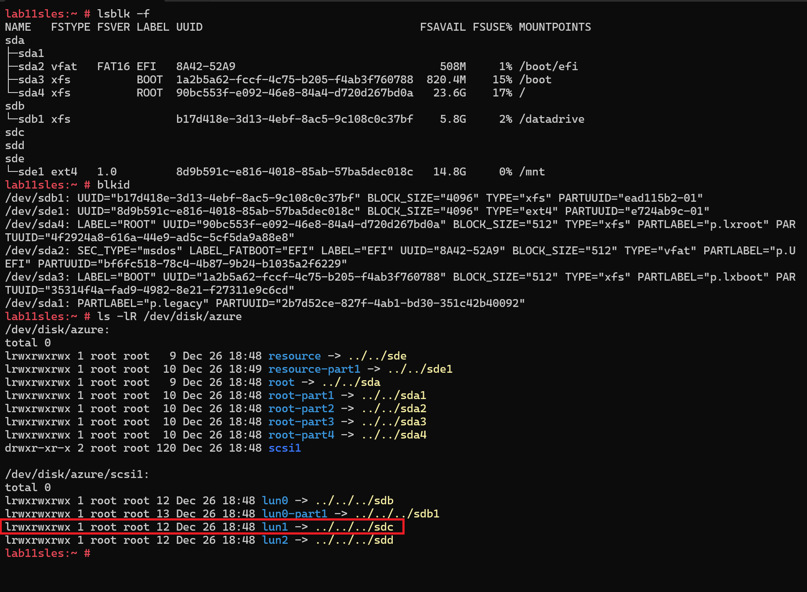
  </details>

Step 3: Create a partition
- As found in the previous step for this system the ```lun1``` points to ```/dev/sdc```. Make sure to match your correct block device.

  ``` bash
  fdisk /dev/sdc
  ```
  > **Note:** The command fdisk is an interactive tool, so it's expecting commands to be enter. Here are some common actions. You can check the fdisk help using ```m```. This time using a GPT and not MBR table partition

  | Fdisk command | Action |  
  |-----------|:-----------:| 
  | g | Create a GPT disklabel | 
  | n | Create new partition |
  | p | Choose partition type |
  | t | Change partition type |
  | w | Write changes to disk | 
  | m | Display fdisk help |
  
  To create the required partition use these steps
    - Create a GPT disklabel on the disk ```g```
    - New partition ```n```
    - Partition number, again, there is a default value, in this case "1" or type ```1```. Notice this time, 128 partitions can be created and not 4 as MBR
    - First sector, select a sector in the range printed, the default will be the first available sector
    - Last sector, select a sector in the range printed, the default will be the last available sector, which means the total of free space
    - Print partition table, using ```p```
    - Change the type of partition ```t```, using ID 44 will set to Linux LVM
    - Write changes to disk using ```w```
    
  <details>
    <summary>Screenshot: Create a new partition on disk LUN 0</summary>

	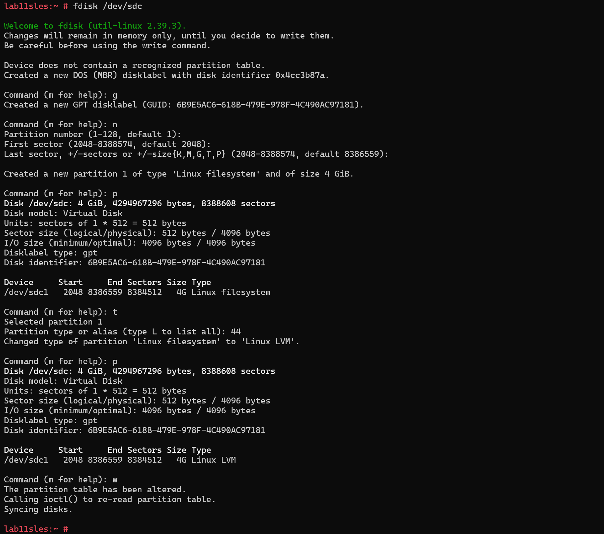
  </details> 

Step 4: Create the LVM structure
- Using the first partition created on LUN 1, create the LVM structure. 
  ``` bash
  pvcreate /dev/disk/azure/scsi1/lun1-part1 # Initialize physical volume on the first partition of LUN 1
  vgcreate vgdata /dev/disk/azure/scsi1/lun1-part1 # Create a volume group on the first partition of LUN 1
  lvcreate -n lvdata -L 3G vgdata # Create a logical volume of 3GB on the volume group
  lvdisplay /dev/vgdata/lvdata # Display the information of the logical volume
  ```
  > **Note:** Use the symbolic link available on ```/dev/disk/azure/scsi1```. The logical volume created is only 3GB

  <details>
    <summary>Screenshot: Create the LVM structure over first partition on LUN 1</summary>

	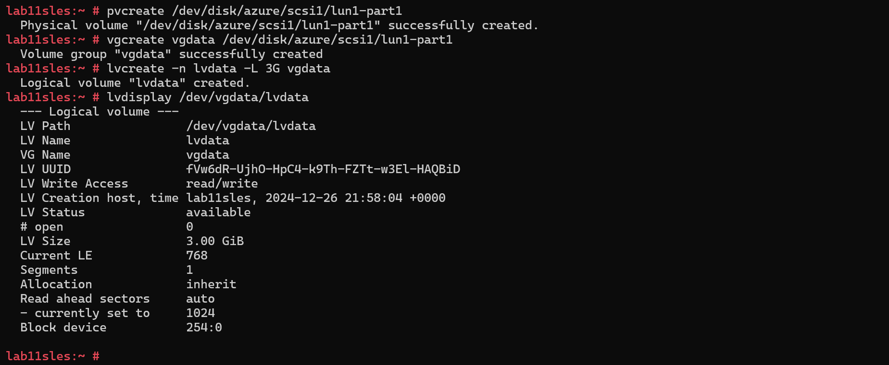
  </details> 

Step 5: Mounting a filesystem
- Creating a mountpoint ```/datadrive2```,create a new filesystem on the logical volume and make the mount point permanent on ```/etc/fstab```
  ``` bash
  mkdir /datadrive2 # Creates the directory /datadrive
  mkfs.ext4 /dev/vgdata/lvdata # Create a new ext4 filesystem over the block device logical volume lvdata
  echo "/dev/vgdata/lvdata /datadrive2 ext4 defaults,nofail 0 2" # This will print to screen the required line to mount this filesystem across reboots
  echo "/dev/vgdata/lvdata /datadrive2 ext4 defaults,nofail 0 2" >> /etc/fstab # After checking previous line is correct, this line can be added to the end for the file /etc/fstab
  mount -a # Mount all filesystems
  df -h /datadrive2 # List filesystem utilization
  ```
  > **Note:** The line added to ```/etc/fstab``` where the last value changed from 0 to 2. A value of 0 means no filesystem check during boot, while a value of 2 means a filesystem check for other filesystems. XFS does not require a filesystem check during the boot process, but it is recommended for ext4 filesystems.

    <details>
    <summary>Screenshot: Creating a new filesystem</summary>

	
  </details>

### Scenario 3: Resize of a filesystem inside a logical volume

#### Overview Lab 11 Scenario 3

- Identify free space in the volume group
- Resize the logical volume using the free space available on the volume group
- Resize the filesystem to match the actual size of the logical volume

#### Instructions Lab 11 Scenario 3

Step 1: Identifing the available free space in a volume group
- Find how much free space is available on the volume group ```/dev/vgdata```
  ``` bash
  vgdisplay /dev/vgdata # This will display the information related to vgdata. Find the "Free PE" section
  ```
  > **Note:** The free space is expressed in PEs (Physical Extents). In this case, there are 255 PEs, and each PE is 4 MiB, for a total of 1020 MiB.

    <details>
    <summary>Screenshot: Extending a logical volume</summary>

	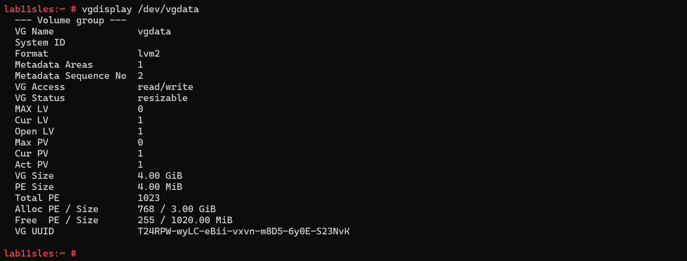
  </details>

Step 2: Extend the logical volume
- Using the free Physical Extents identified in the previous step, add the total of free space to the logical volume lvdata
  ``` bash
  lvs # Display information about logical volumes
  lvextend -l +100%FREE /dev/vgdata/lvdata # Extend the logical volume lvdata to use all the available free space in the volume group vgdata.
  lvs # Display information about logical volumes
  df -h /datadrive2 # Display filesystem utilization, notice this is still the old size
  resize2fs /dev/vgdata/lvdata # Resize the filesystem on the logical volume lvdata
  df -h /datadrive2 # # Display filesystem utilization, this time shows the right size
  ```

  > **Note:** There are some differences on the tools to resize a XFS filesystem. [Increasing the size of an XFS file system in RHEL 9](https://docs.redhat.com/en/documentation/red_hat_enterprise_linux/9/html/managing_file_systems/increasing-the-size-of-an-xfs-file-system_managing-file-systems)

    <details>
    <summary>Screenshot: Extending an ext4 filesystem</summary>

	
  </details>


### Scenario 4: Resize of a filesystem using an additional disk with LVM

#### Overview Lab 11 Scenario 4

- Resize the logical volume using a separate block device
- Resize the filesystem to match the actual size of the logical volume

#### Instructions Lab 11 Scenario 4

Step 1: Identify the right disk
- This VM has been deployed with several data disks. Identify the LUN ID 2 using the commands ```lsblk``` and ```blkid```, and with the content of the directory ```/dev/disk/azure```, list and identify the attached disks.
  ``` bash
  lsblk -f # List all block devices including the filesystem information
  blkid # Print block device attributes
  ls -lR /dev/disk/azure # Recursively lists all symbolic links to block devices
  ```

  > **Note:** Same as previoous scenario, the system was rebooted, now LUN 2 is using ```/dev/sdd```. This highlights the importance of not using the block devices ```/dev/sdX``` in ```/etc/fstab```

  > There is a symbolic link for each disk on the system, so the LUN ID 1 is represented with the file ```/dev/disk/azure/scsi1/lun2```. Also you can identify easily the OS disk identified as root and the resource disk.

  > All data disks are listed under the directory ```/dev/disk/azure/scsi1```

  <details>
    <summary>Screenshot: Identify the disk LUN 2</summary>

	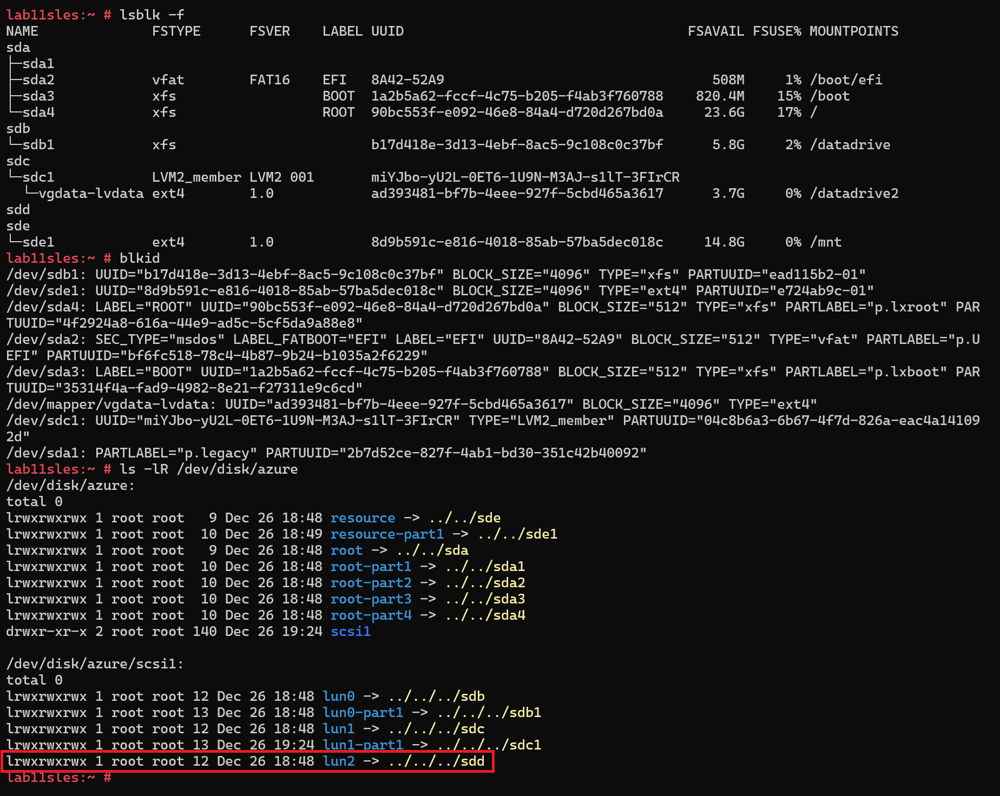
  </details>

Step 2: Adding LUN 2 to the volume group
- Add the LUN 2, this time identified as ```/dev/sdd``` to the volume group /dev/vgdata. Use the device block ```/dev/disk/azure/scsi1/lun2```
  ``` bash
  pvs # Display information about physical volumes
  pvcreate  /dev/disk/azure/scsi1/lun2
  pvs # Display information about physical volumes, this time LUN 2 will appear as a valida physical volume
  vgextend /dev/vgdata /dev/disk/azure/scsi1/lun2 # Add the new physical volume to the volume group
  pvs # Display information about physical volumes, the LUN 2 will be assigned to the volume group vgdata
  vgs # Display information about volume groups, vgdata will have 2 Physical Volumes
  lvs # Display logical volume information
  lvextend -l +100%FREE /dev/vgdata/lvdata # Extend the logical volume to use all the free space available on the volume group
  lvs # The logical volume will be using all the free space
  ```
  > **Note:** Using partitions are not a requirement while using LVM, in this scenario, the whole LUN 2 disk has been added

  <details>
    <summary>Screenshot: Extend the logical volume using LUN 2</summary>

	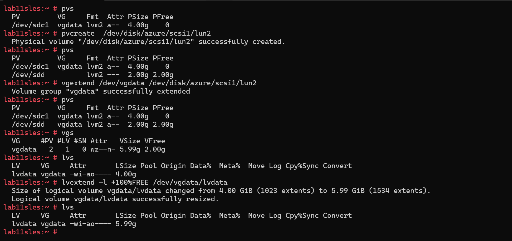
  </details>

Step 3: Resize of the filesystem
- Once the logical volume has been resized the filesystem can be resize
  ``` bash
  df -h /datadrive2 # Check the size of the filesystem
  resize2fs /dev/vgdata/lvdata # Resize the filesystem using the logical volume block device
  df -h /datadrive2 #  # Check the size of the filesystem, this time it will reflect the new size
  ```
  <details>
    <summary>Screenshot: Extend the filesystem</summary>

	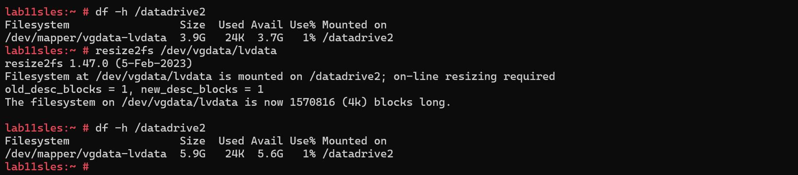
  </details>

### Scenario 5: Running filesystem check

#### Overview Lab 11 Scenario 5

- Running a filesystem check over different filesystem types ext4 vs xfs
- Identify the difference between XFS over other traditional filesystems related to ```fsck``` during the boot process

#### Instructions Lab 11 Scenario 5

Step 1: Filesystem check ext4 filesystem
- Use the previous ext4 filesystem mounted on ```/datadrive2```. Umount that filesystem and then run the fsck over this filesystem
  ``` bash
  umount  /dev/vgdata/lvdata # Umount the logical volume, you could use as parameter the mount point /datadrive2 as well
  fsck /dev/vgdata/lvdata # Run the filesystem check using the previous logical volume
  mount -a # Mount all the filesystems back
  ```

  <details>
  <summary>Screenshot: Running a filesystem check ext4</summary>

	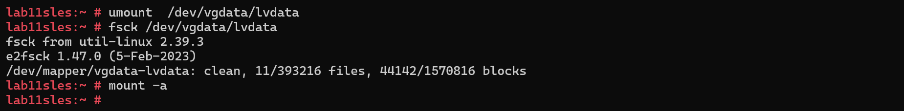
  </details>

Step 2: Filesystem check xfs filesystem
- Use the previous ext4 filesystem mounted on ```/datadrive```. Umount that filesystem and then run the fsck over this filesystem
  ``` bash
  mount | grep -w  datadrive # Locate which it's the block device used for /datadrive
  umount /datadrive # Umount the filesystem
  fsck /dev/sdb1 # Notice fsck doesn't work on XFS filesystems
  xfs_repair /dev/sdb1 # The xfs_repair is the correct command to repair a filesystem
  mount -a # Mount all the filesystems back
  ```
  
  > **Note:** The XFS filesystem is designed not to require an ```fsck``` during each reboot. Most issues with this filesystem can be corrected by simply mounting it. If there is a bigger issue, the ```xfs_repair``` tool can be used.

  <details>
  <summary>Screenshot: Running a filesystem check for XFS</summary>

	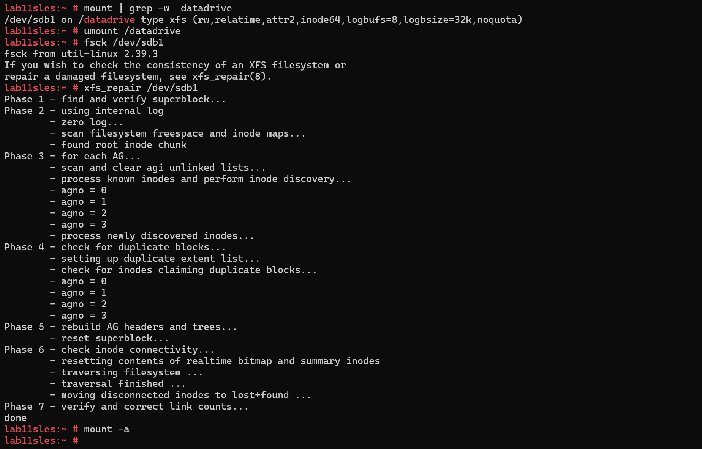
  </details>

[Return to main menu](https://github.com/mitchcr/specialist/blob/main/README.md)
